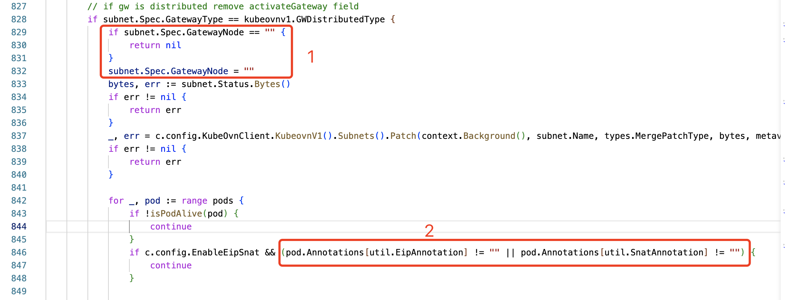
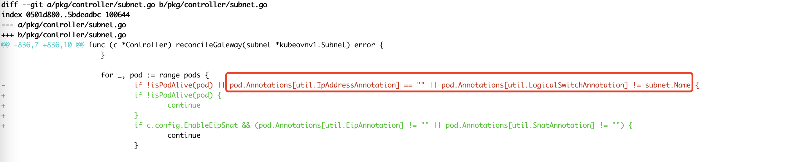

---kind:   - Troubleshootingproducts:    - Alauda Container Platform   - Alauda DevOps   - Alauda AI   - Alauda Application Services   - Alauda Service Mesh   - Alauda Developer PortalProductsVersion:   - 4.1.0,4.2.x---<!-- A type of document that involves encountering a fault, diag...it, performing root cause analysis, and providing solutions. --># 宝信集中式子网切换问题ovn-default子网下的部分pod出现访问不了外部网络的情况## Cause- 集中式子网切换分布式后activeGateway字段未清空（1.8.16之前版本）- 子网切换时pod过滤条件缺少subnet匹配导致跨子网影响## Resolution- 修改ovn-default子网的gatewayNode配置- 删除当前activeGateway配置- 等待子网重新更新网关节点## [workaround]## [Related Information]**Screenshots**- Environment: Kube-OVN v1.8.16, ACP 3.6.2- kube-ovn- subnet- activeGateway- gatewayNode- centralized_subnet- distributed_subnet- Component: Kubernetes- Page ID: 149593125- Original Title: 宝信集中式子网切换问题