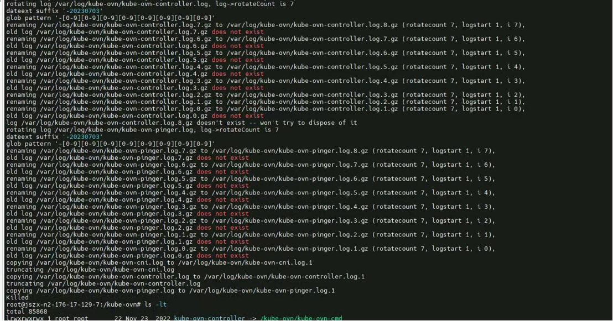
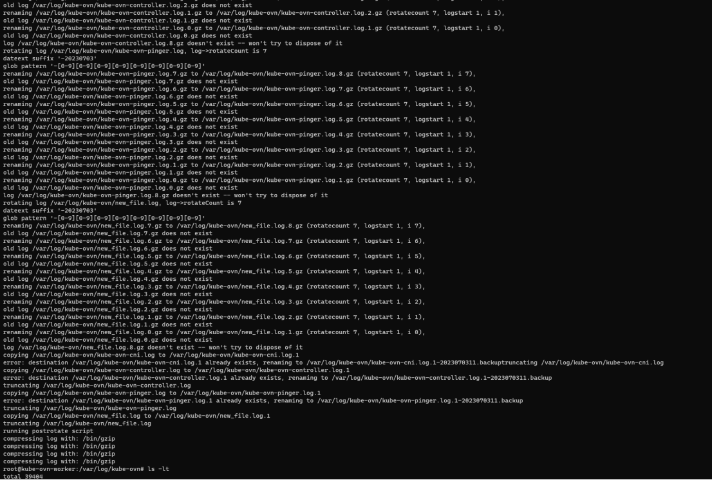
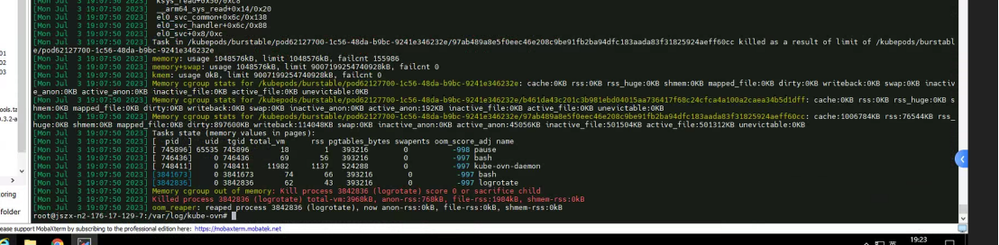

---kind:   - Troubleshootingproducts:    - Alauda Container Platform   - Alauda DevOps   - Alauda AI   - Alauda Application Services   - Alauda Service Mesh   - Alauda Developer PortalProductsVersion:   - 4.1.0,4.2.x---<!-- A type of document that involves encountering a fault, diag...it, performing root cause analysis, and providing solutions. --># kubekube-ovn-pinger备份log一天增长20G 每小时执行logrotate时进程被killed 备份文件仅拷贝未压缩导致体积增大## Cause- kube-ovn-cni默认内存限制1G不足- logrotate执行truncate/compress前触发OOM终止## Resolution- mv /var/log/kube-ovn/kube-ovn-pinger.log到其他目录- kubectl rollout restart ds/kube-ovn-pinger## [workaround]## [Related Information]**Screenshots**- Environment: Kube-OVN v1.8.14- /etc/logrotate.d/ovn- kube-ovn-cni- logrotate配置- memory limit- /var/log/kube-ovn/kube-ovn-pinger.log- Component: Kubernetes- Page ID: 152641332- Original Title: kube-ovn-pinger 备份log一天增加20G大小