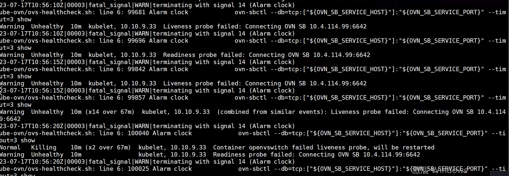

---
kind:
  - Troubleshooting
products:
  - Alauda Container Platform
  - Alauda DevOps
  - Alauda AI
  - Alauda Application Services
  - Alauda Service Mesh
  - Alauda Developer Portal
ProductsVersion:
  - 4.1.0,4.2.x
---
<!-- A type of document that involves encountering a fault, diagnosing it, performing root cause analysis, and providing solutions. -->

# 虚拟机迁移之后ovn容器网络异常

容器IP无法访问 ovs-ovn容器因健康检查失败重启 节点间ovn0网卡IP无法ping通

## Cause
- 内网限制UDP 6081协议

## Resolution
- 放开内网UDP 6081端口限制

## [workaround]

## [Related Information]
**Screenshots**

- Environment: 3.6.x
- ovn容器
- ovs-ovn
- ovn0网卡
- UDP 6081
- Component: kube-Ovn
- Page ID: 152660393
- Original Title: 虚拟机迁移之后ovn容器网络异常
