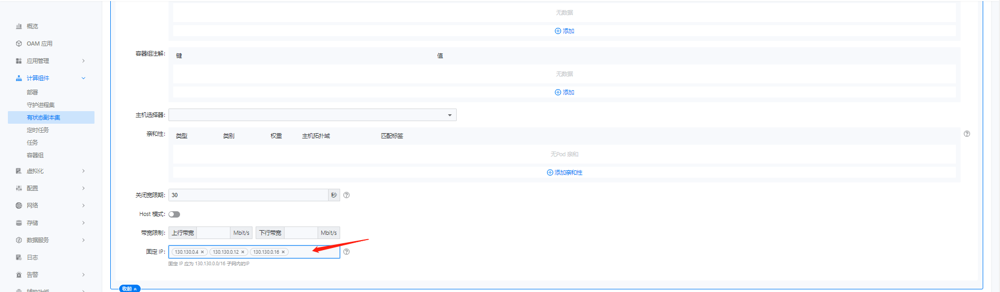

---
kind:
  - Troubleshooting
products:
  - Alauda Container Platform
  - Alauda DevOps
  - Alauda AI
  - Alauda Application Services
  - Alauda Service Mesh
  - Alauda Developer Portal
ProductsVersion:
  - 4.1.0,4.2.x
---
<!-- A type of document that involves encountering a fault, diagnosing it, performing root cause analysis, and providing solutions. -->

# kube

Pod无法获取指定IP/MAC IP/MAC冲突导致应用创建失败 通过平台修改annotations无效

## Cause
- 指定的IP/MAC与现有资源冲突
- 通过平台界面修改annotations不生效

## Resolution
- 检查IP/MAC是否已被占用
- 直接修改YAML文件添加annotations
- 对StatefulSet执行kubectl delete po操作触发重建

## [workaround]

## [Related Information]
**Screenshots**

- Environment: kube-ovn v1.11.x
- ovn.kubernetes.io/ip_address
- ovn.kubernetes.io/mac_address
- StatefulSet
- Component: kube-ovn
- Page ID: 152664406
- Original Title: kube-ovn 应用固定ip/mac
