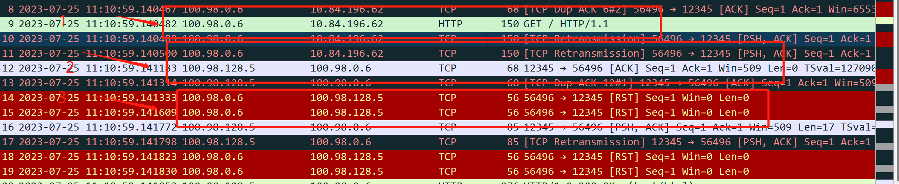
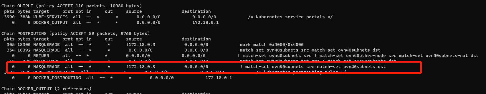

---kind:   - Troubleshootingproducts:    - Alauda Container Platform   - Alauda DevOps   - Alauda AI   - Alauda Application Services   - Alauda Service Mesh   - Alauda Developer PortalProductsVersion:   - 4.1.0,4.2.x---<!-- A type of document that involves encountering a fault, diag...it, performing root cause analysis, and providing solutions. --># ovn关闭natOutgoing后pod访问外部服务报错connection reset by peer 抓包显示回包src IP被改为ovn0地址 跨网关流量触发iptables规则错误SNAT## Cause- 跨网关回包时缺少conntrack记录- iptables nat规则误匹配ovn40subnets集合## Resolution- 手动添加iptables规则：iptables -t nat -I POSTROUTING 5 -m set ! --match-set ovn40subnets src -m set --match-set ovn40subnets dst -j RETURN## [workaround]## [Related Information]**Screenshots**- Environment: Kube-OVN v1.9.17- natOutgoing- ovn0- ovn40subnets ipset- conntrack- POSTROUTING链- Component: Kubernetes- Page ID: 152665569- Original Title: ovn-overlay，分布式网关，容器与物理网络打通后，容器内访问外部网络报错连接被重置