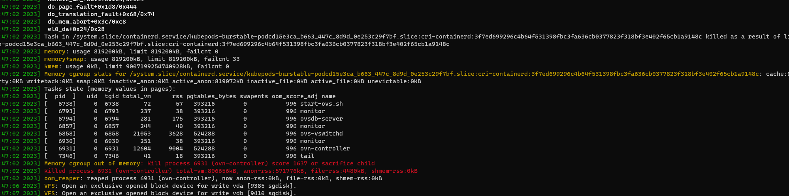
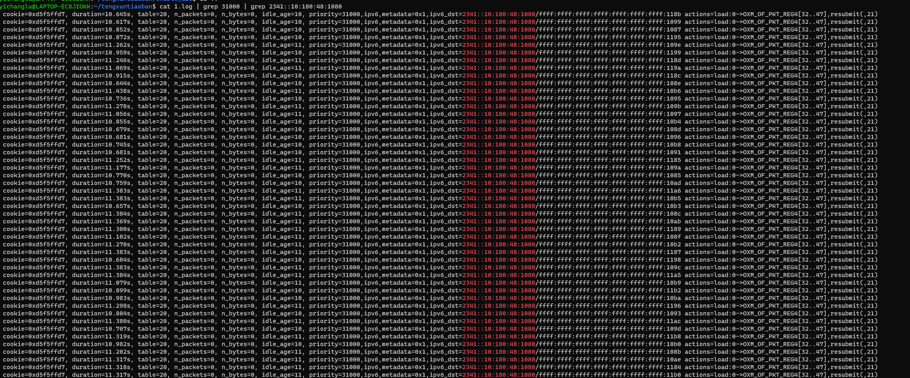
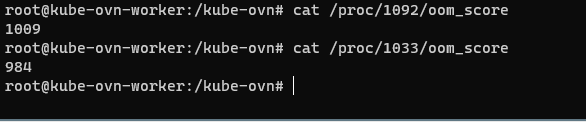
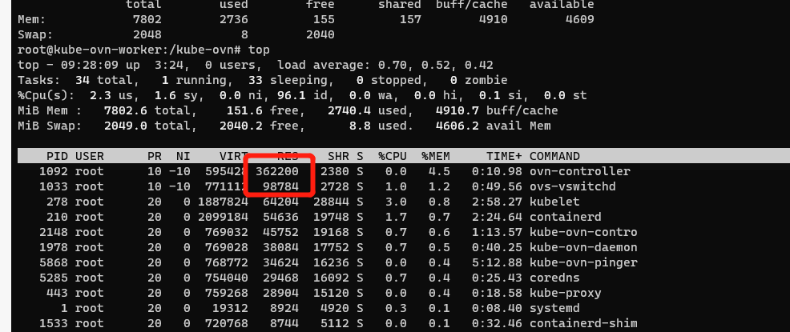

---
kind:
  - Troubleshooting
products:
  - Alauda Container Platform
  - Alauda DevOps
  - Alauda AI
  - Alauda Application Services
  - Alauda Service Mesh
  - Alauda Developer Portal
ProductsVersion:
  - 4.1.0,4.2.x
---
<!-- A type of document that involves encountering a fault, diagnosing it, performing root cause analysis, and providing solutions. -->

# ovn集群，ovn

kube-ovn-cni pod无法启动，dmesg -T显示OOM日志 ovs-appctl bridge/dump-flows br-int显示大量priority=31000的openflow表项 当ovn.default.u2o_exclude_ip.ip4地址数量超过7时稳定复现OOM

## Cause
- u2o功能开启导致生成大量31000优先级的openflow表项
- ovn-controller在解析u2o_exclude_ip规则时会将underlay subnet切分为大量细粒度流表
- address set地址数量增加导致流表数量指数级增长

## Resolution
- 关闭u2o功能
- 应用补丁https://github.com/kubeovn/kube-ovn/pull/3099

## [workaround]
- 调整ovn.default.u2o_exclude_ip.ip4地址数量不超过7

## [Related Information]
**Screenshots**

- Environment: CNI版本：Kube-OVN v1.9.27
- u2o功能
- ovn-controller
- openflow表项
- priority=31000
- ovn.default.u2o_exclude_ip.ip4
- br-int网桥
- Component: kube-Ovn
- Page ID: 155322051
- Original Title: ovn集群，ovn-controller oom
