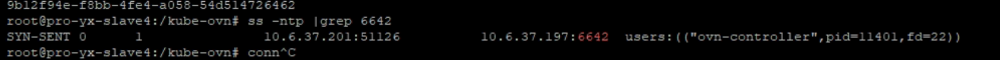
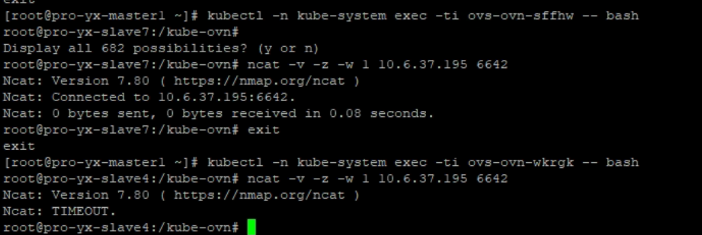

---kind:   - Troubleshootingproducts:    - Alauda Container Platform   - Alauda DevOps   - Alauda AI   - Alauda Application Services   - Alauda Service Mesh   - Alauda Developer PortalProductsVersion:   - 4.1.0,4.2.x---<!-- A type of document that involves encountering a fault, diag...it, performing root cause analysis, and providing solutions. --># 某个节点无法正常加入集群，状态一直是 NotReady节点状态持续为NotReady kube-ovn-cni日志显示节点与join网关通信异常 ovn-controller日志报错连接sb数据库失败## Cause- 网络策略/防火墙阻断故障节点与sb数据库的TCP通信## Resolution- 调整外部网络策略，开放故障节点到sb数据库的TCP端口## [workaround]## [Related Information]**Screenshots**- Environment: Kubernetes with kube-ovn CNI- kube-ovn-cni- ovn-controller- sb数据库- TCP端口- Component: Kubernetes- Page ID: 158335083- Original Title: 某个节点无法正常加入集群，状态一直是 NotReady