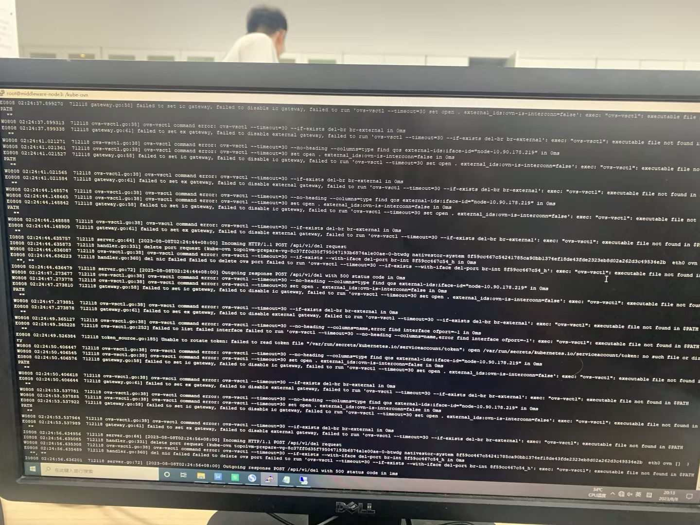
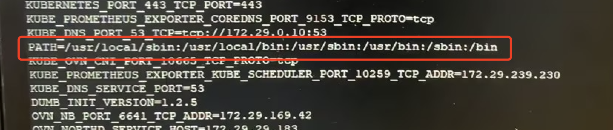

---kind:   - Troubleshootingproducts:    - Alauda Container Platform   - Alauda DevOps   - Alauda AI   - Alauda Application Services   - Alauda Service Mesh   - Alauda Developer PortalProductsVersion:   - 4.1.0,4.2.x---<!-- A type of document that involves encountering a fault, diag...it, performing root cause analysis, and providing solutions. --># exec: "ovspod 无法正常删除 kube-ovn-cni 报错 ovs-vsctl not found in $PATH## Cause- 节点安装了公安部安全工具 G01 导致 kube-ovn-daemon 进程的 PATH 环境变量异常## Resolution- 卸载 G01 安全工具- 重建 kube-ovn-cni pod## [workaround]## [Related Information]**Screenshots**- kube-ovn-cni- kube-ovn-daemon- ovs-vsctl- G01 安全工具- Component: Kubernetes- Page ID: 158335138- Original Title: exec: "ovs-vsctl": executable file not found in $PATH