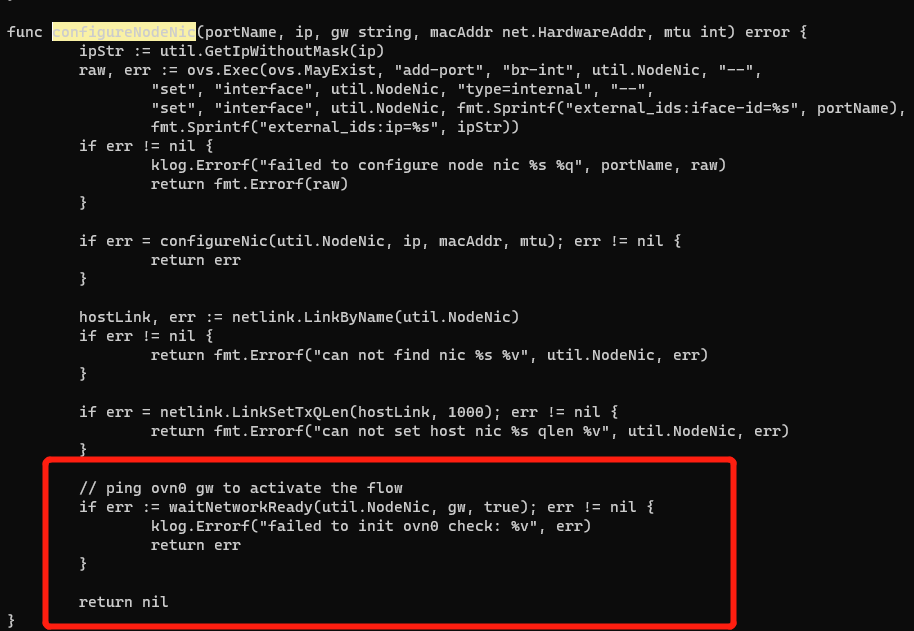

---kind:   - Troubleshootingproducts:    - Alauda Container Platform   - Alauda DevOps   - Alauda AI   - Alauda Application Services   - Alauda Service Mesh   - Alauda Developer PortalProductsVersion:   - 4.1.0,4.2.x---<!-- A type of document that involves encountering a fault, diag...it, performing root cause analysis, and providing solutions. --># 新加入的节点，kubekube-ovn-cni启动失败 ping ovn0网关IP不通 ovn-controller日志出现transaction error## Cause- 节点被剔除后重新加入时sb数据库残留旧的chassis数据## Resolution- 重新恢复数据库## [workaround]## [Related Information]**Screenshots**- Environment: CNI: Kube-OVN v1.7.3- kube-ovn-cni- ovn-controller- ovn-central- sb chassis- ovn0网关- Component: Kubernetes- Page ID: 158794176- Original Title: 新加入的节点，kube-ovn-cni启动失败