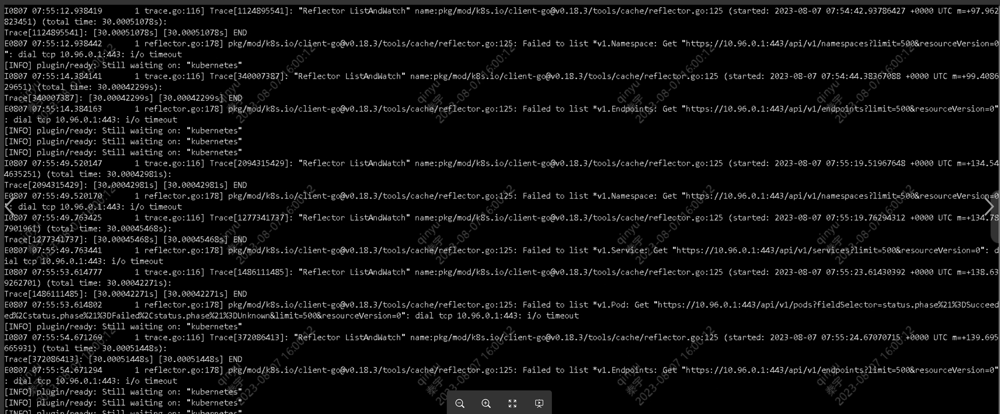
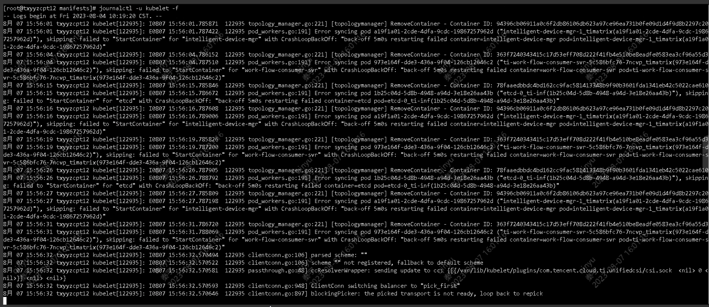

---
kind:
  - Troubleshooting
products:
  - Alauda Container Platform
  - Alauda DevOps
  - Alauda AI
  - Alauda Application Services
  - Alauda Service Mesh
  - Alauda Developer Portal
ProductsVersion:
  - 4.1.0,4.2.x
---
<!-- A type of document that involves encountering a fault, diagnosing it, performing root cause analysis, and providing solutions. -->

# 3.4

coredns和大量容器无法启动 连接kubernetes超时(443) curl测试正常但pod启动失败

## Cause
- ovn checksum功能导致overlay网络异常
- 内核/网卡驱动问题导致udp checksum异常

## Resolution
- 在每个ovs-ovn-xxxx的pod中执行命令：ovs-vsctl set open . external-ids:ovn-encap-csum=false

## [workaround]

## [Related Information]
**Screenshots**

- Environment: TKE 3.4.3-arm版本，ovn overlay网络，ovn 1.6版本，物理机环境
- ovn
- ovs
- coredns
- external-ids:ovn-encap-csum
- udp checksum
- Component: kube-Ovn
- Page ID: 161385235
- Original Title: 3.4-overlay网络-coredns和部分pod无法启动
