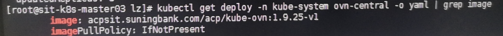
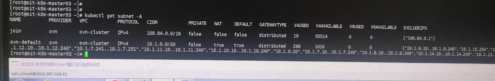
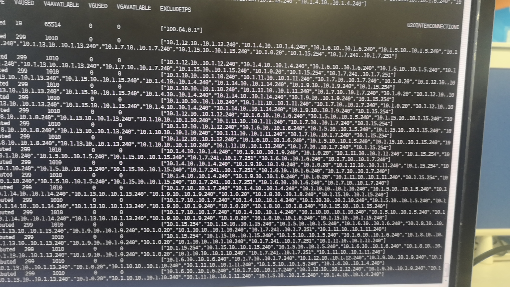
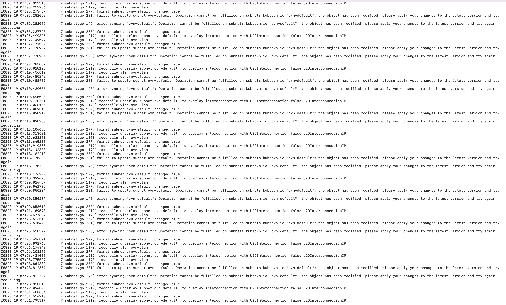

---kind:   - Troubleshootingproducts:    - Alauda Container Platform   - Alauda DevOps   - Alauda AI   - Alauda Application Services   - Alauda Service Mesh   - Alauda Developer PortalProductsVersion:   - 4.1.0,4.2.x---<!-- A type of document that involves encountering a fault, diag...it, performing root cause analysis, and providing solutions. --># 苏宁银行 ns 导入问题导入ns失败 ns的annotation持续刷新 子网excludeIPs字段不断更新## Cause- 子网excludeIPs字段持续更新触发annotation刷新循环## Resolution- 删除子网的excludeIPs字段- 更新至修复后的Kube-OVN镜像（hotfix）## [workaround]- 删除excludeIPs字段以临时恢复## [Related Information]**Screenshots**- Environment: Kube-OVN 1.9.25 (特定commit), ACP v3.12.1- subnet- excludeIPs- kube-ovn- ACP- Component: Kubernetes- Page ID: 161386869- Original Title: 苏宁银行 ns 导入问题