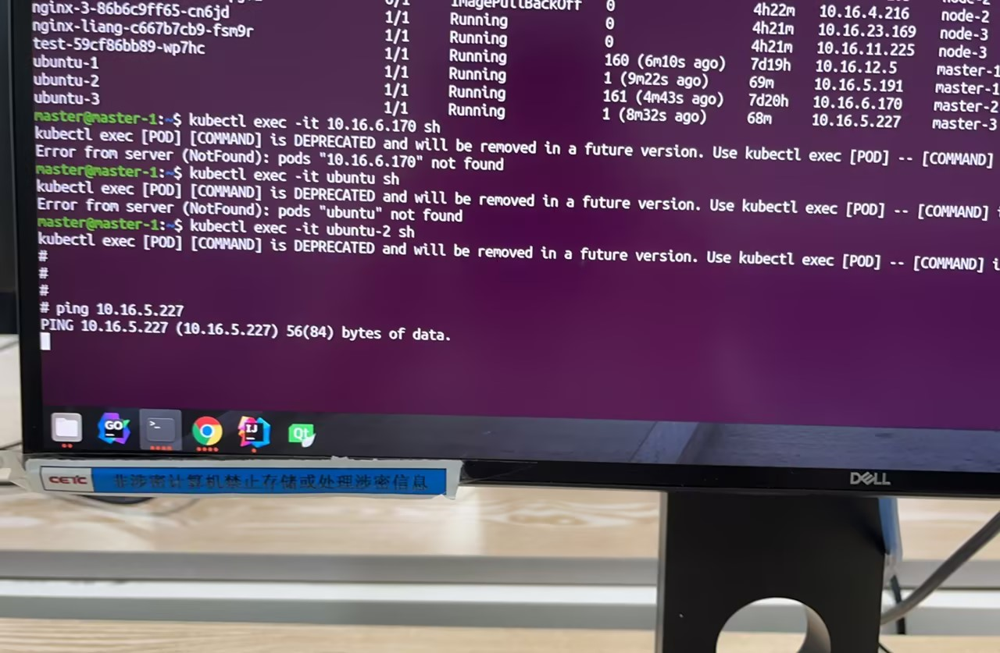
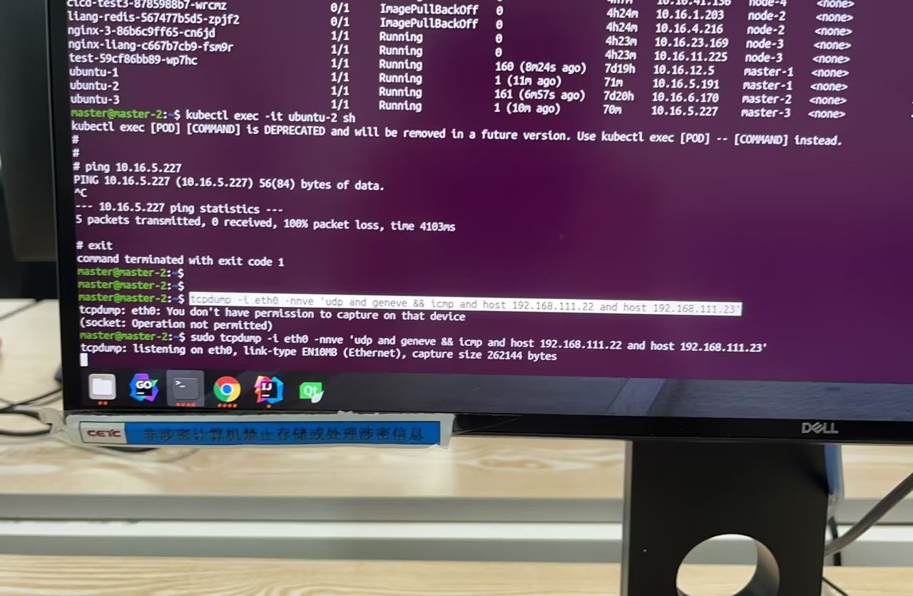
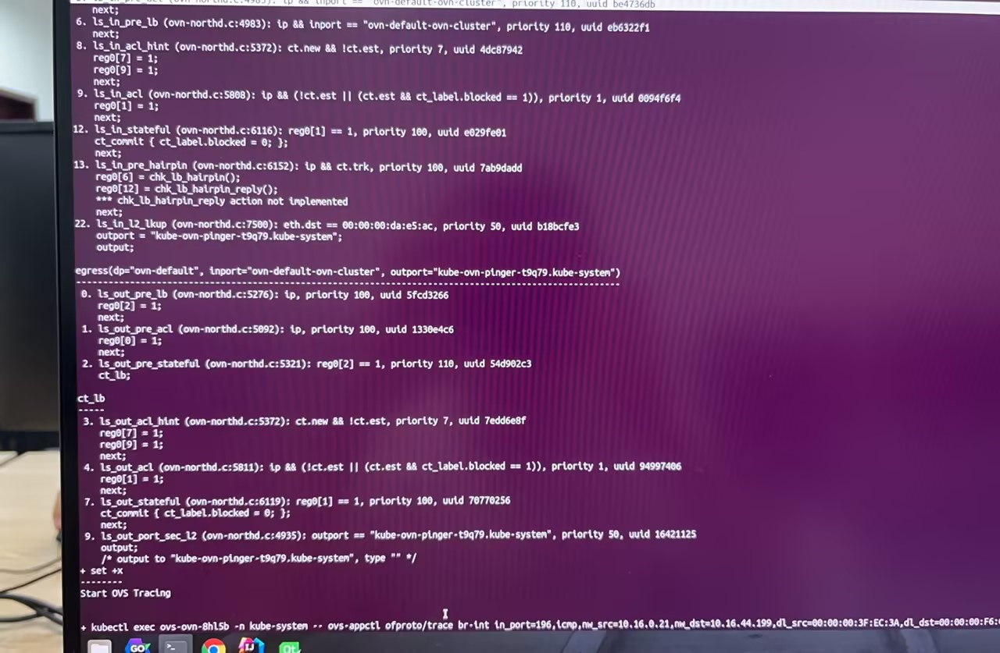
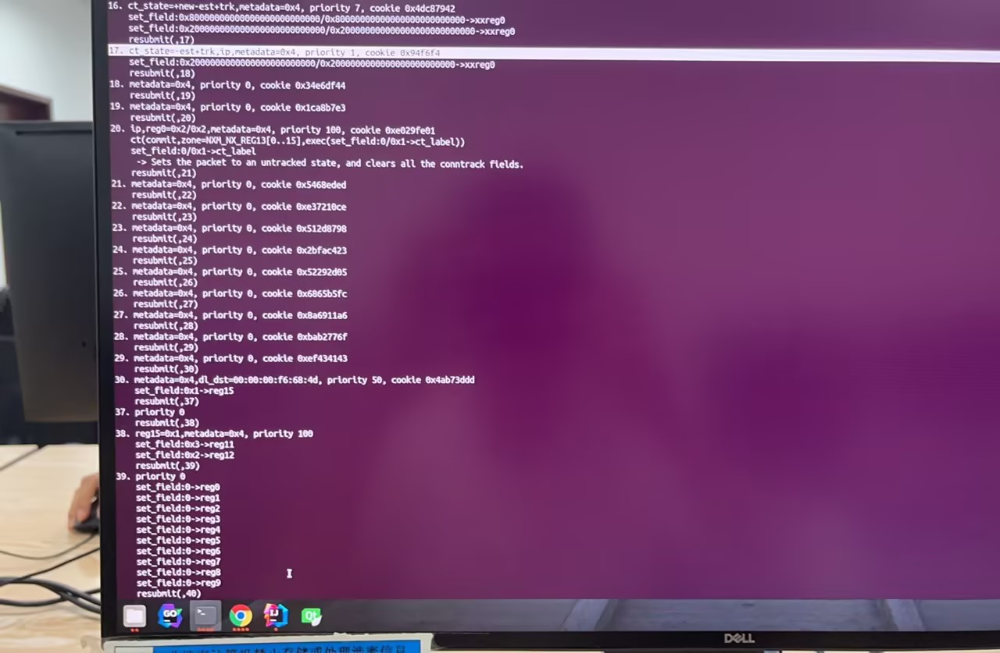
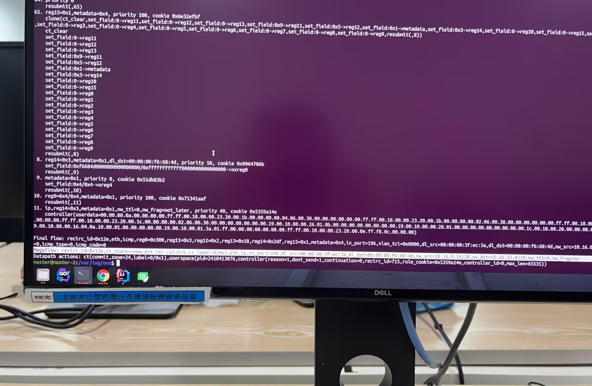
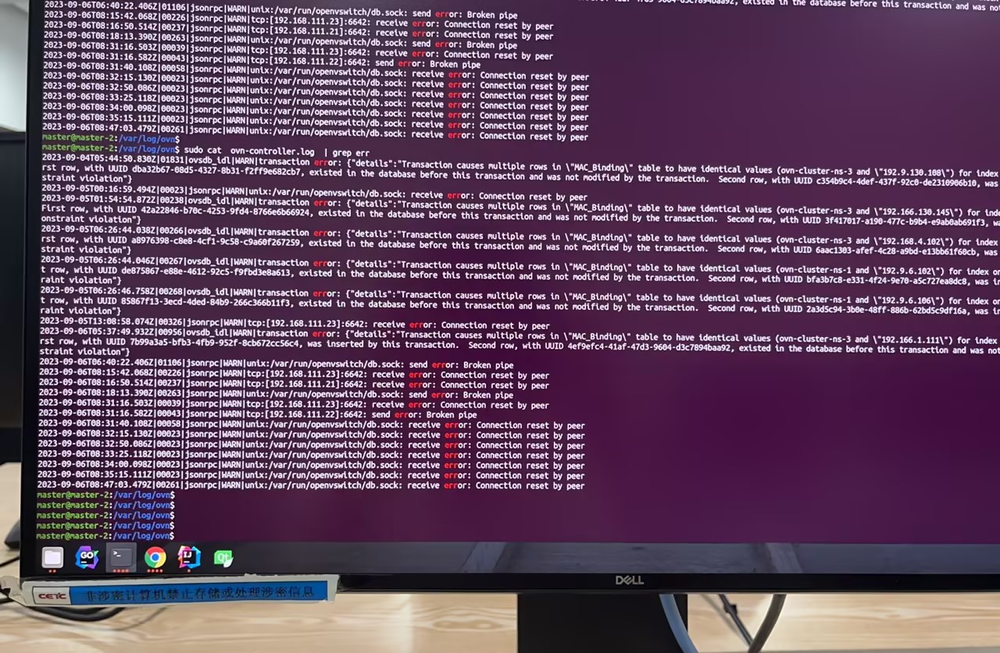
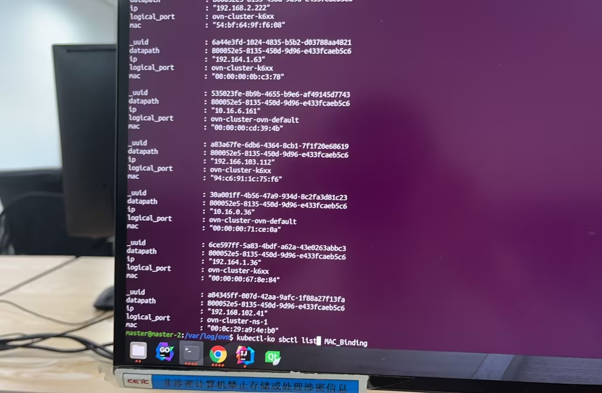
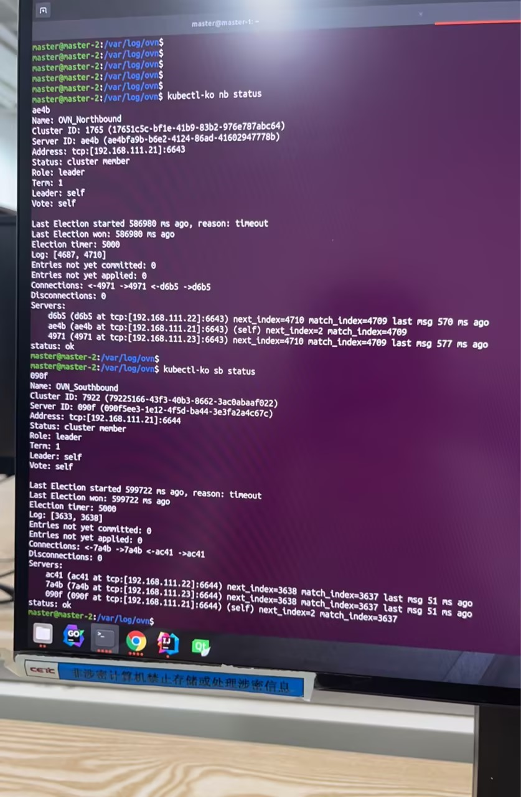

---kind:   - Troubleshootingproducts:    - Alauda Container Platform   - Alauda DevOps   - Alauda AI   - Alauda Application Services   - Alauda Service Mesh   - Alauda Developer PortalProductsVersion:   - 4.1.0,4.2.x---<!-- A type of document that involves encountering a fault, diag...it, performing root cause analysis, and providing solutions. --># 电科院 kubemaster02节点上的所有pod无法与其他节点pod通信 master02节点物理网卡抓不到pod发出的报文 ovs流表缺少output to kernel tunnel的log## Cause- ovn逻辑流表转物理流表异常- mac_binding表中存在无效datapath_id- ovn数据库可能存在异常状态## Resolution- 重启集群所有主机## [workaround]## [Related Information]**Screenshots**- Environment: Kubernetes非ACP平台, kube-ovn v1.9.28- kubectl-ko trace- ovn-controller.log- mac_binding表- datapath表- ovs流表- nb/sb数据库- Component: kube-ovn- Page ID: 163056458- Original Title: 电科院 kube-ovn,出现某个节点上的pod都ping不通