---kind:   - Troubleshootingproducts:    - Alauda Container Platform   - Alauda DevOps   - Alauda AI   - Alauda Application Services   - Alauda Service Mesh   - Alauda Developer PortalProductsVersion:   - 4.1.0,4.2.x---<!-- A type of document that involves encountering a fault, diag...it, performing root cause analysis, and providing solutions. --># 中科宇航 underlay 环境，节点访问pod 不通underlay网络pod访问不通，尤其202节点访问本节点及跨节点pod均不通 节点bond1未抓到ICMP报文 发送ARP请求后跨节点通信恢复## Cause- 交换机转发异常导致bond1接口流量未正确处理## Resolution- 关闭交换机bond0接口的一个网卡## [workaround]- 在pod中发送ARP请求临时恢复通信## [Related Information]**Screenshots**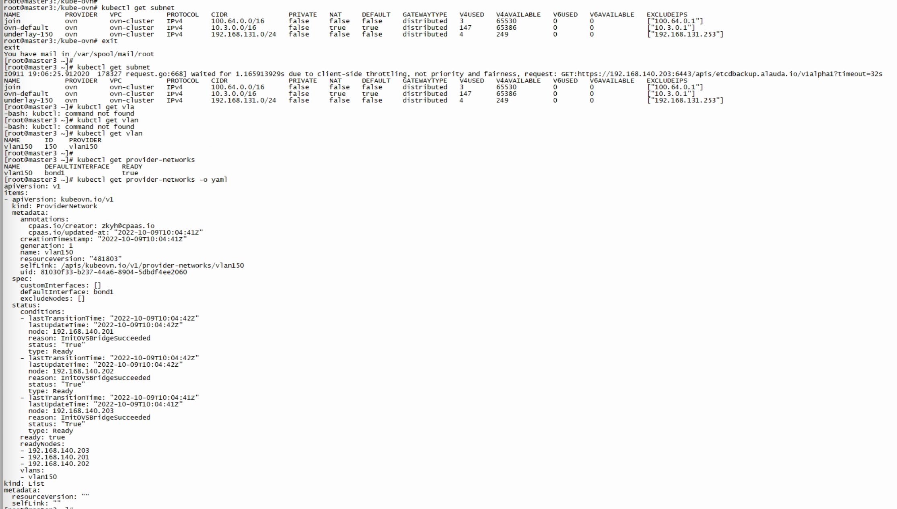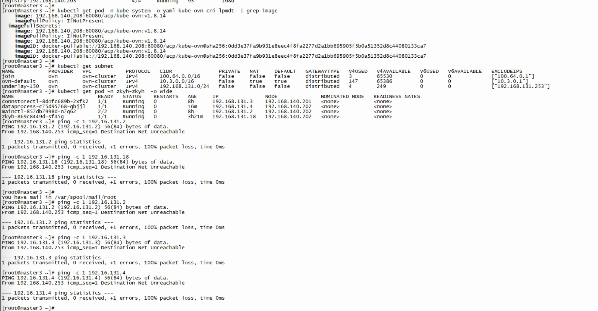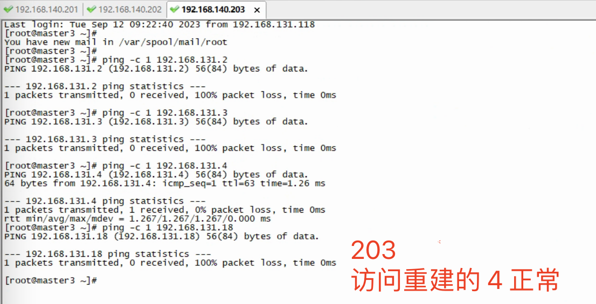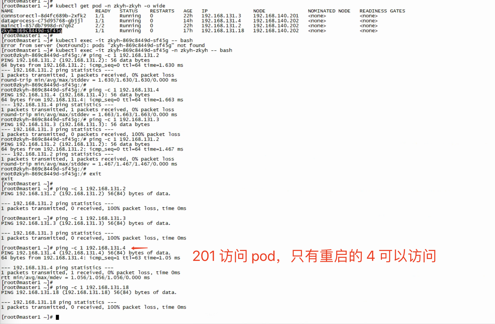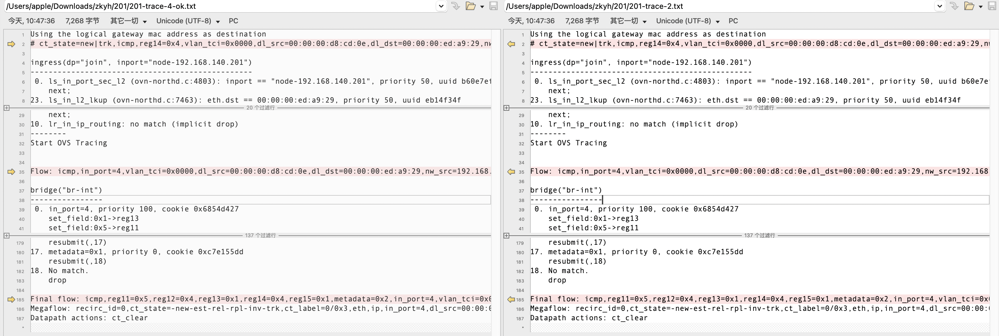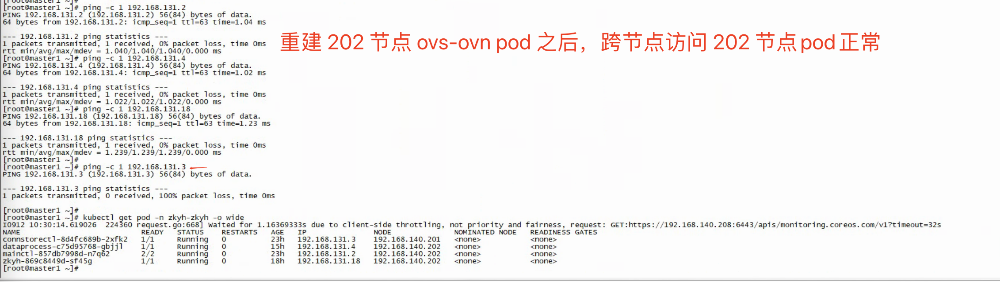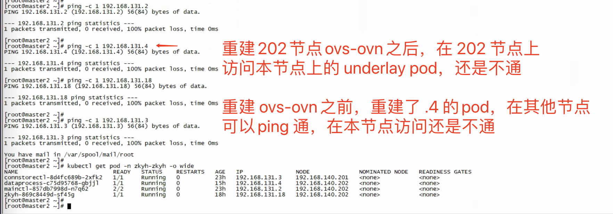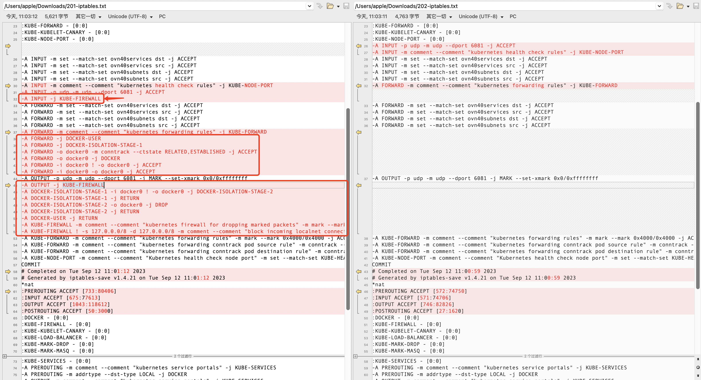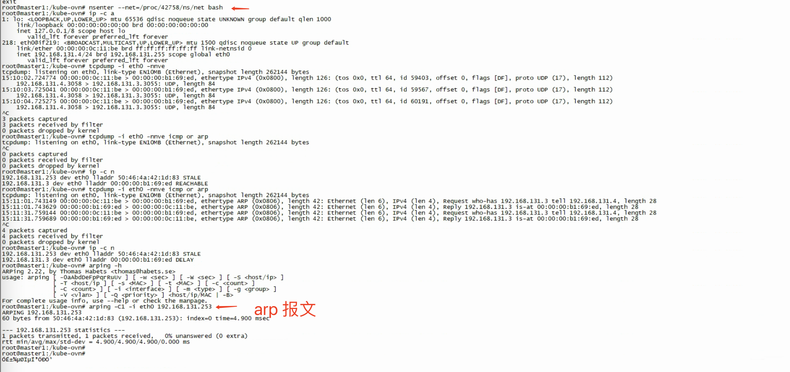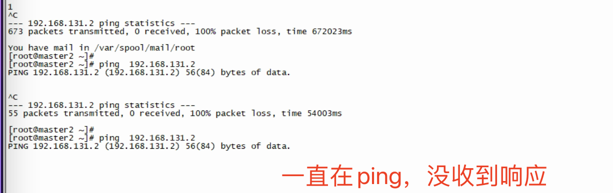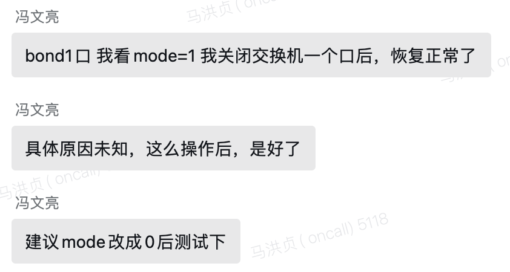- Environment: Kube-OVN 1.8.14, ACP 3.8.2- bond1- ovn-nb/sb- kube-ovn- iptables- provider-networks- ovs-ovn pod- Component: kube-Ovn- Page ID: 163061934- Original Title: 中科宇航 underlay 环境，节点访问pod 不通