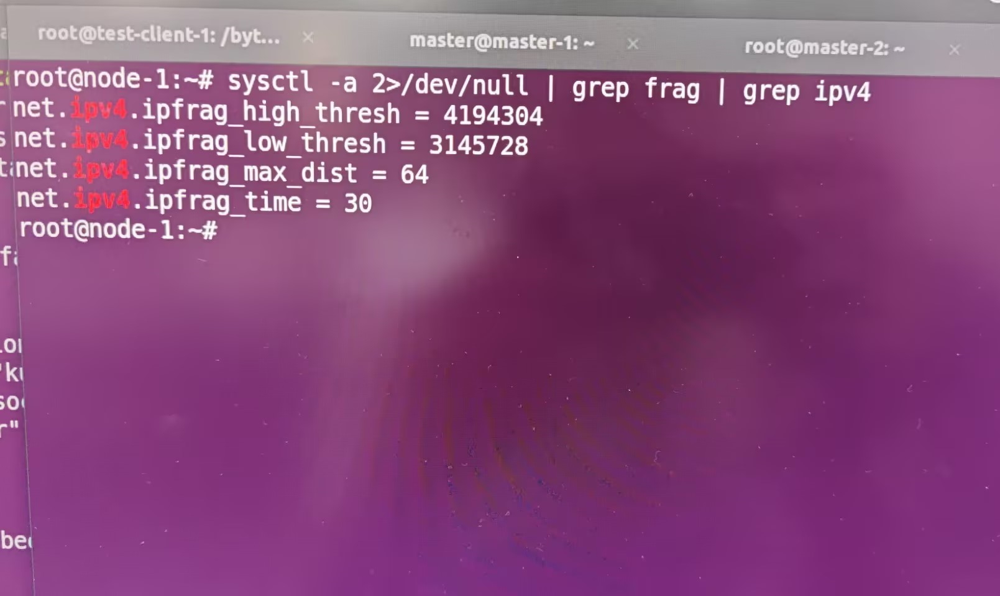

---
kind:
  - Troubleshooting
products:
  - Alauda Container Platform
  - Alauda DevOps
  - Alauda AI
  - Alauda Application Services
  - Alauda Service Mesh
  - Alauda Developer Portal
ProductsVersion:
  - 4.1.0,4.2.x
---
<!-- A type of document that involves encountering a fault, diagnosing it, performing root cause analysis, and providing solutions. -->

# 电科院 kube

u2o:true时组播性能在非master节点下降36% u2o:true时单播在master节点100%丢包 u2o:false时组播/单播在master节点性能差(1.05Gbps)

## Cause
- master节点ipfrag分片buffer配置过低
- master节点MTU 1400导致UDP分片
- master节点网卡udp分片offload关闭
- u2o开启导致组播报文广播到overlay网络

## Resolution
- 开启网卡udp分片offload: ethtool -K <interface> tx-udp_tnl-segmentation on
- 设置logical_switch_port的mcast_flood=false: kubectl ko nbctl set logical_switch_port kx66-ovn-cluster options:mcast_flood=false

## [workaround]

## [Related Information]
**Screenshots**

- Environment: Kubernetes(kube-ovn v1.9.28)/underlay网络/非ACP平台
- multicast_snoop
- mcast_flood
- logical_switch_port
- ipfrag_high_thresh/ipfrag_low_thresh
- MTU 1400/1500
- udp分片offload配置
- Component: kube-ovn
- Page ID: 163061999
- Original Title: 电科院 kube-ovn, 出现组播性能下降
