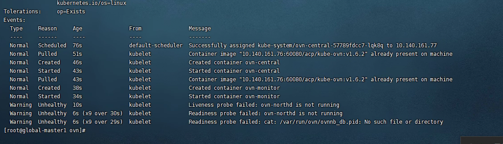
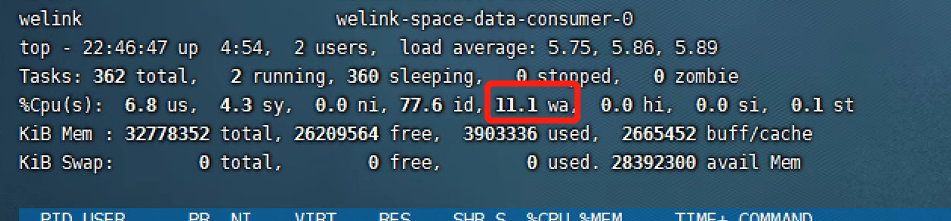

---kind:   - Troubleshootingproducts:    - Alauda Container Platform   - Alauda DevOps   - Alauda AI   - Alauda Application Services   - Alauda Service Mesh   - Alauda Developer PortalProductsVersion:   - 4.1.0,4.2.x---<!-- A type of document that involves encountering a fault, diag...it, performing root cause analysis, and providing solutions. --># 国电投ovnovn-central pods failing to start kubectl operations slow high wa (I/O wait) observed## Cause- High disk I/O wait causing component failures## Resolution- Remove liveness probes from ovn-central pods## [workaround]- Temporarily delete liveness probes in ovn-central## [Related Information]**Screenshots**- Environment: Kubernetes acp 3.4, CNI kube-ovn v1.6.2- ovn-central- liveness probe- /etc/orgin/ovn/- kube-ovn:v1.6.2- Component: Kubernetes- Page ID: 163079002- Original Title: 国电投ovn-central起不来