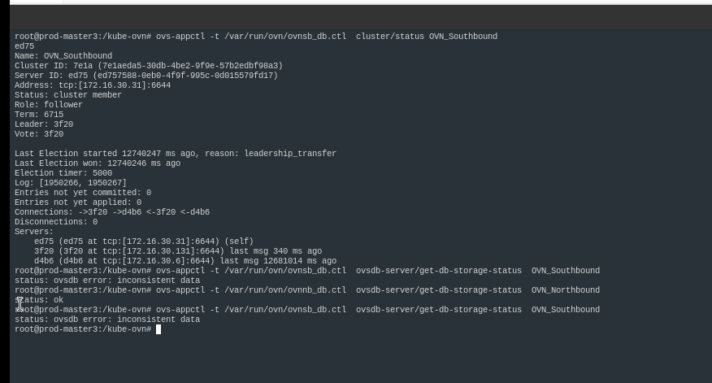

---kind:   - Troubleshootingproducts:    - Alauda Container Platform   - Alauda DevOps   - Alauda AI   - Alauda Application Services   - Alauda Service Mesh   - Alauda Developer PortalProductsVersion:   - 4.1.0,4.2.x---<!-- A type of document that involves encountering a fault, diag...it, performing root cause analysis, and providing solutions. --># 华西办公厅 SB 数据库 inconstistent datainconsistent data in SB database## Cause- ovn-northd bug in versions prior to 1.9## Resolution- Remove problematic node- Clean local SB database- Rejoin node to cluster## [workaround]## [Related Information]**Screenshots**- Environment: Kylin OS, CNI 1.7- ovn-northd- SB database- raft- Component: Kubernetes- Page ID: 163082689- Original Title: 华西办公厅 SB 数据库 inconstistent data