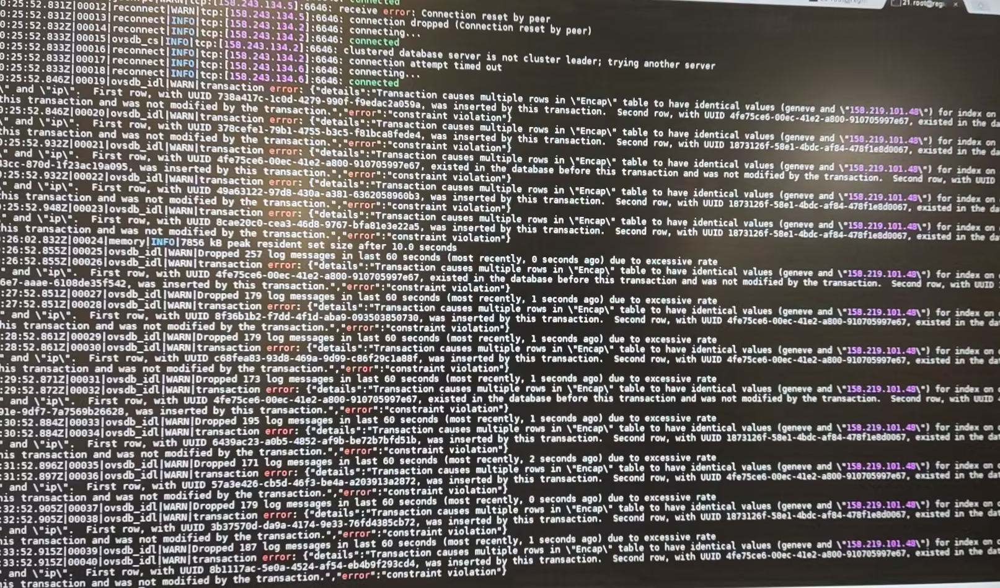

---kind:   - Troubleshootingproducts:    - Alauda Container Platform   - Alauda DevOps   - Alauda AI   - Alauda Application Services   - Alauda Service Mesh   - Alauda Developer PortalProductsVersion:   - 4.1.0,4.2.x---<!-- A type of document that involves encountering a fault, diag...it, performing root cause analysis, and providing solutions. --># 集群互联 OVN跨集群 Pod IP 访问不通 ovn-ic.log 中存在 chassis 资源冲突报错## Cause- 集群重建后重新加入互联导致 ovn-ic-db 残留旧 chassis 资源## Resolution- 在 ovn-ic-db leader 容器执行: ovn-ic-sbctl destroy gateway/availability_zone xxxx## [workaround]## [Related Information]**Screenshots**- Environment: CNI:v1.9.25, ACP:v3.12- ovn-ic- kube-ovn-controller- ovn-ic-db- /var/log/ovn/ovn-ic.log- Component: Kubernetes- Page ID: 165015203- Original Title: 集群互联 OVN-IC 偶现跨集群 Pod IP 不通