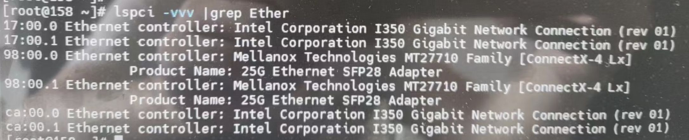
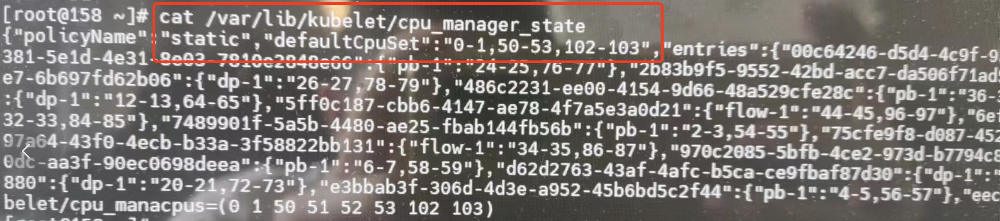
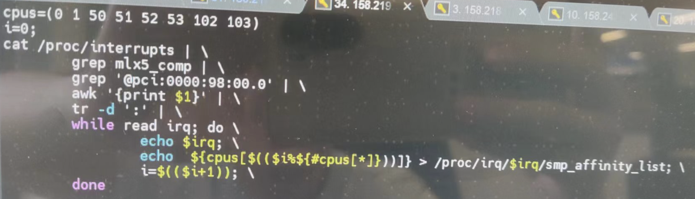
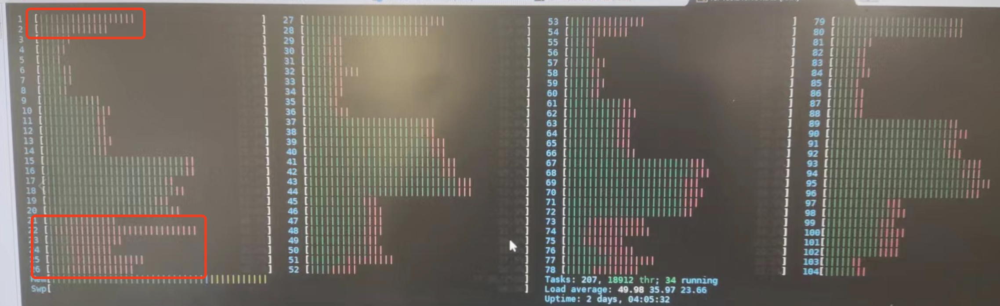

---kind:   - Troubleshootingproducts:    - Alauda Container Platform   - Alauda DevOps   - Alauda AI   - Alauda Application Services   - Alauda Service Mesh   - Alauda Developer PortalProductsVersion:   - 4.1.0,4.2.x---<!-- A type of document that involves encountering a fault, diag...it, performing root cause analysis, and providing solutions. --># 集群互联 OVN集群互联的网关节点上应用绑定的 CPU Core 使用率 ~100% 软中断占用过高（通过 /proc/interrupts 确认） 性能测试结果不理想## Cause- Mellanox 25G 网卡中断处理集中在部分 CPU Core- OVN-IC 未正确启用 ECMP 路由导致流量负载不均衡## Resolution- 停止 irqbalance 服务：systemctl stop irqbalance- 手动绑定网卡中断到空闲 CPU Core- 修改 kube-ovn-controller 配置启用 ECMP 路由- 升级 ovn-ic db 数据库版本（需处理 route_table 字段兼容问题）## [workaround]- 添加 LSP 并关闭路由学习- 手动配置 ECMP 路由实现流量均衡## [Related Information]**Screenshots**- Environment: CNI v1.9.25, ACP v3.12- /proc/interrupts- mlx5_xxx@pci:0000:98:00.0- irqbalance- kube-ovn-controller- ovn-ic- ECMP- Component: Kubernetes- Page ID: 165015268- Original Title: 集群互联 OVN-IC 网关节点 CPU 软中断过高