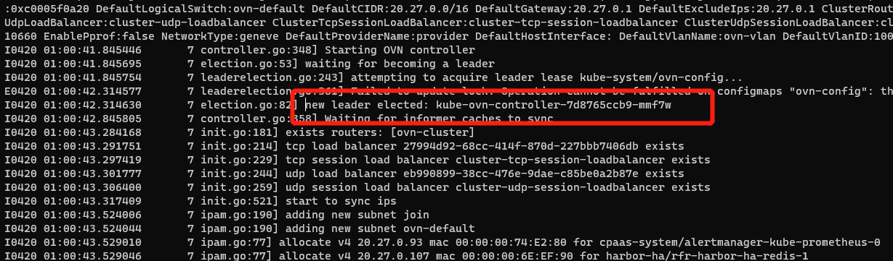
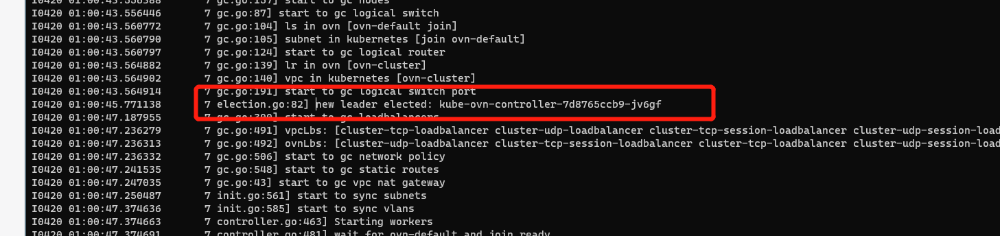
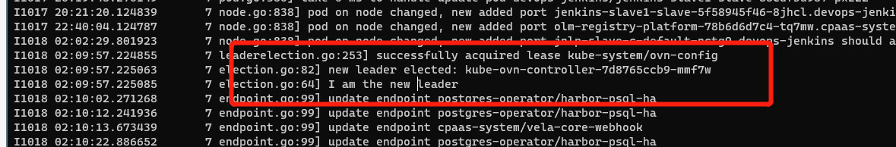

---kind:   - Troubleshootingproducts:    - Alauda Container Platform   - Alauda DevOps   - Alauda AI   - Alauda Application Services   - Alauda Service Mesh   - Alauda Developer PortalProductsVersion:   - 4.1.0,4.2.x---<!-- A type of document that involves encountering a fault, diag...it, performing root cause analysis, and providing solutions. --># 宝信ip冲突pod创建失败 kube-ovn-controller日志显示相同ip的lsp已被分配## Cause- kube-ovn-controller存在多个leader导致ipam未同步## Resolution- 重启kube-ovn-controller pod触发重新选主和初始化ipam## [workaround]## [Related Information]**Screenshots**- Environment: CNI: kube-ovn 1.8.14, OS: x86- kube-ovn-controller- lsp- ipam- BXRJ-101- Component: Kubernetes- Page ID: 165015811- Original Title: 宝信ip冲突