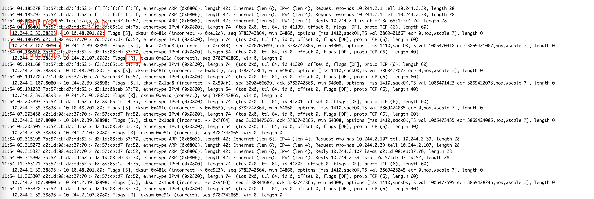

---kind:   - Troubleshootingproducts:    - Alauda Container Platform   - Alauda DevOps   - Alauda AI   - Alauda Application Services   - Alauda Service Mesh   - Alauda Developer PortalProductsVersion:   - 4.1.0,4.2.x---<!-- A type of document that involves encountering a fault, diag...it, performing root cause analysis, and providing solutions. --># 3.14.1发版，access 集群，flannel 同节点svc 访问不通同节点svc访问不通## Cause- 节点重启后系统参数net.bridge.bridge-nf-call-iptables未生效## Resolution- 执行sysctl -w net.bridge.bridge-nf-call-iptables=1- 持久化系统参数配置## [workaround]## [Related Information]**Screenshots**- Environment: Kubernetes with flannel- net.bridge.bridge-nf-call-iptables- flannel- iptables- bridge模块- Component: Kubernetes- Page ID: 168303820- Original Title: 3.14.1发版，access 集群，flannel 同节点svc 访问不通