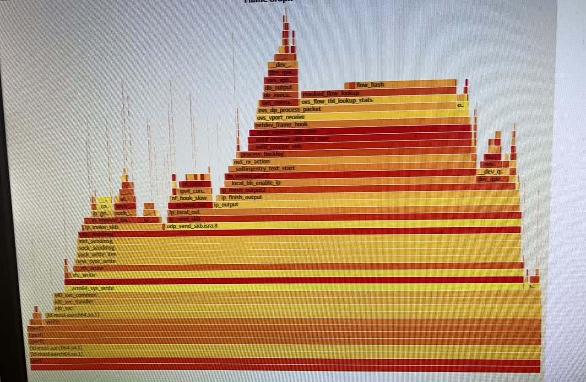
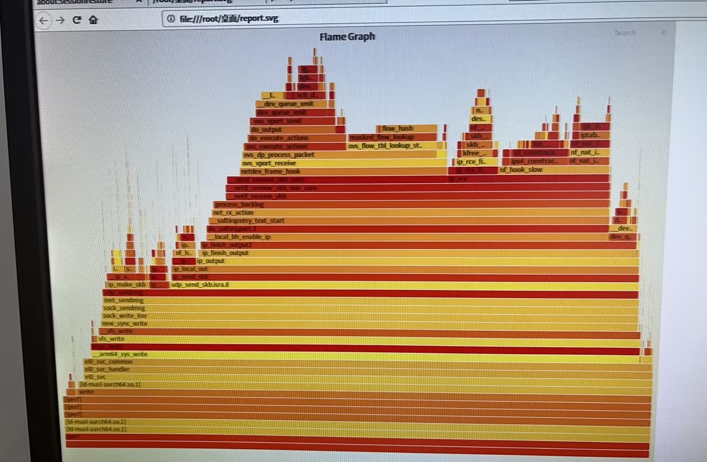
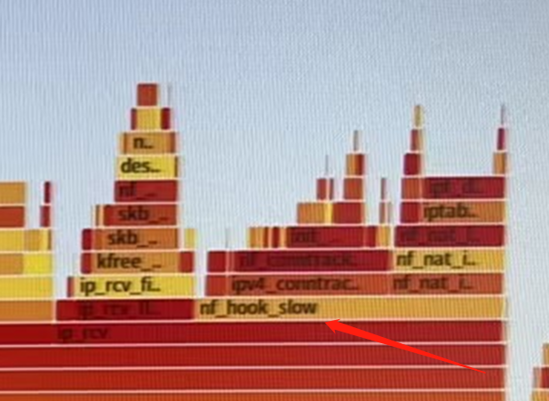
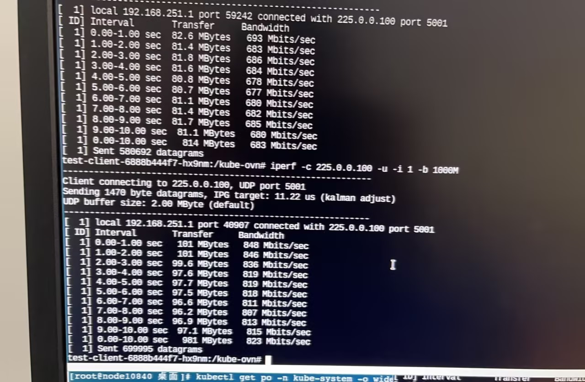
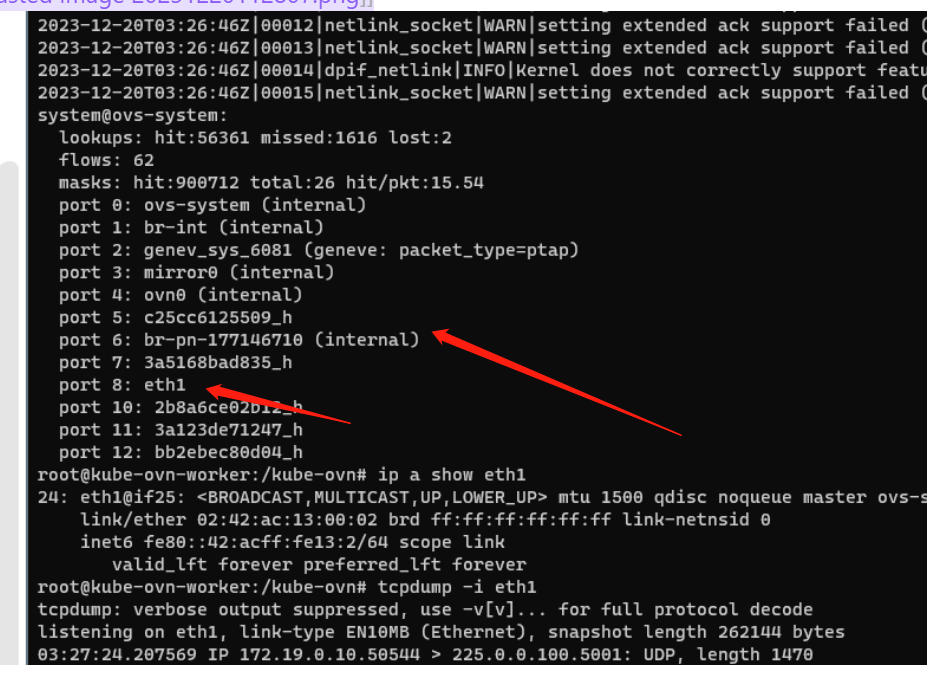
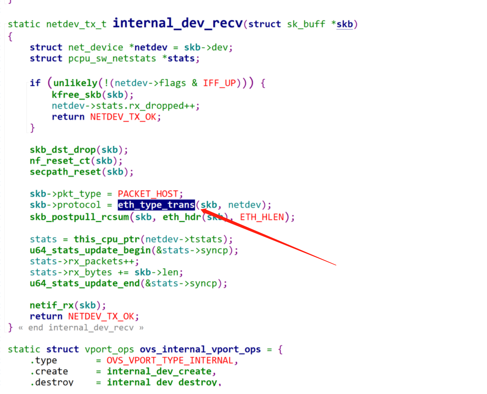

---kind:   - Troubleshootingproducts:    - Alauda Container Platform   - Alauda DevOps   - Alauda AI   - Alauda Application Services   - Alauda Service Mesh   - Alauda Developer PortalProductsVersion:   - 4.1.0,4.2.x---<!-- A type of document that involves encountering a fault, diag...it, performing root cause analysis, and providing solutions. --># 电科院跨节点组播性能调优跨节点组播性能700Mbits低于单播950Mbits 火焰图显示组播流量多出ip_rcv处理逻辑 nf_hook_slow环节消耗性能## Cause- underlay网络组播流量经过internal类型网桥(br-provider)时触发eth_type_trans组播处理逻辑- 组播报文在网桥处理中进入ip_rcv路径导致额外开销## Resolution- 添加iptables规则跳过conntrack: iptables -t raw -A PREROUTING -d {组播IP} -j NOTRACK- 清理br-provider网桥消除ip_rcv路径## [workaround]- 通过NOTRACK规则提升15%性能(700Mbits→800Mbits)## [Related Information]**Screenshots**- Environment: 飞腾(Phytium)/CNI v1.9.29- iptables/PREROUTING链- br-provider网桥- nf_hook_slow- ip_rcv- eth_type_trans- IP_MULTICAST_LOOP- Component: Kubernetes- Page ID: 170363885- Original Title: 电科院跨节点组播性能调优