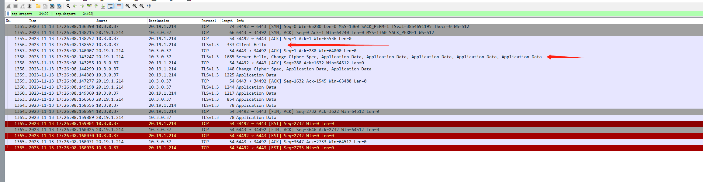
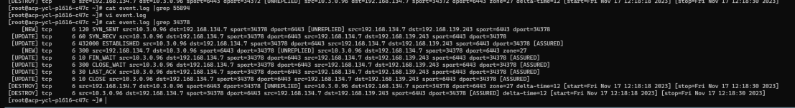

---kind:   - Troubleshootingproducts:    - Alauda Container Platform   - Alauda DevOps   - Alauda AI   - Alauda Application Services   - Alauda Service Mesh   - Alauda Developer PortalProductsVersion:   - 4.1.0,4.2.x---<!-- A type of document that involves encountering a fault, diag...it, performing root cause analysis, and providing solutions. --># 温州银行  容器出网未做snaterebus pod向业务集群vip发送未经SNAT的报文 物理网卡出现大量未SNAT的RST报文 conntrack存在大量unreplied条目## Cause- RST报文seq小于对端最大ACK导致conntrack状态更新失败- kube-ovn 1.9版本存在unreplied conntrack条目问题- SNAT动作依赖的conntrack表项未正确生成## Resolution- iptables -I POSTROUTING -t mangle -m state --state INVALID -j DROP## [workaround]## [Related Information]**Screenshots**- Environment: Kubernetes 3.12.1, kube-ovn 1.9.25- kube-ovn- conntrack- iptables- POSTROUTING链- nf_conntrack_tcp_packet- nf_conntrack_log_invalid- Component: Kubernetes- Page ID: 171901718- Original Title: 温州银行  容器出网未做snat