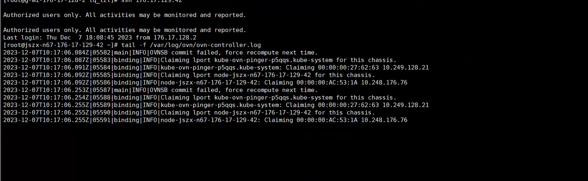
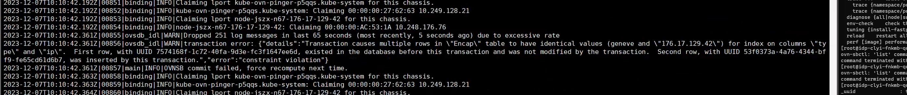
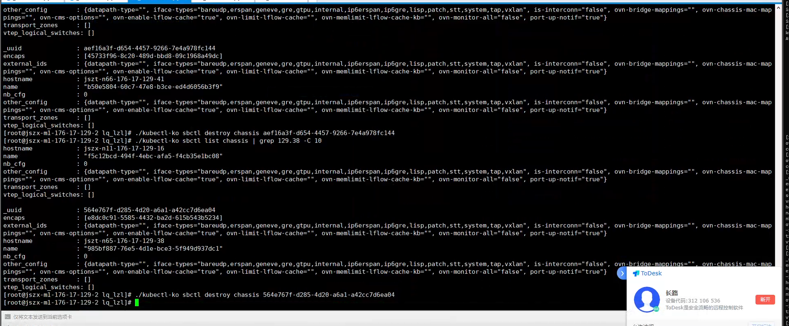

---
kind:
  - Troubleshooting
products:
  - Alauda Container Platform
  - Alauda DevOps
  - Alauda AI
  - Alauda Application Services
  - Alauda Service Mesh
  - Alauda Developer Portal
ProductsVersion:
  - 4.1.0,4.2.x
---
<!-- A type of document that involves encountering a fault, diagnosing it, performing root cause analysis, and providing solutions. -->

# 新加节点上的所有容器访问api

新加入节点的pod无法访问api-server 控制节点无法ping通新节点上的pod ovs表转换问题导致流量被drop

## Cause
- sb chassis表中记录的节点名称与实际加入的节点名不一致
- 节点曾退出集群后重新加入并修改过节点名称

## Resolution
- 清理无效chassis记录：./kubectl ko sbctl destory chassis {uuid}

## [workaround]

## [Related Information]
**Screenshots**

- Environment: CNI 版本：v1.9.29
- ovn-controller
- sb chassis表
- kubectl ko trace
- ovs表
- Component: kube-Ovn
- Page ID: 176264815
- Original Title: 新加节点上的所有容器访问api-server不通
