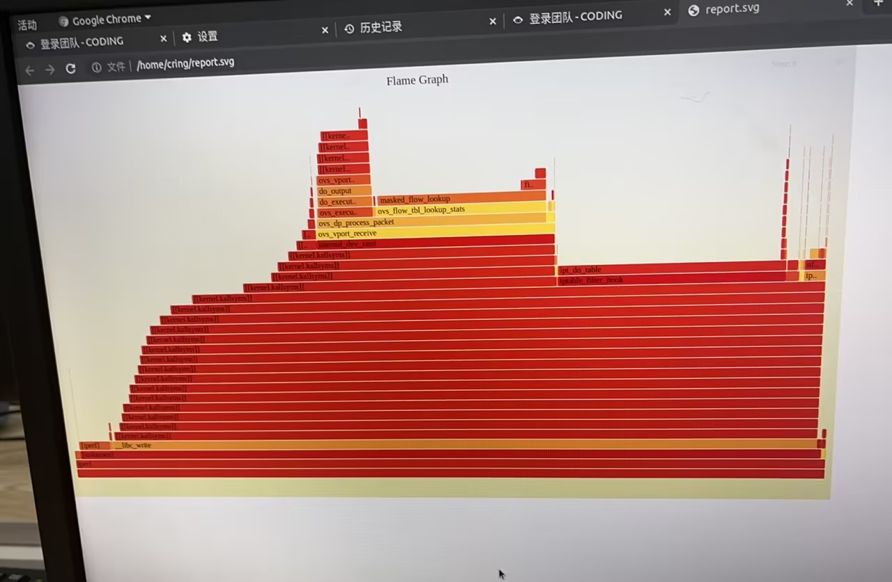
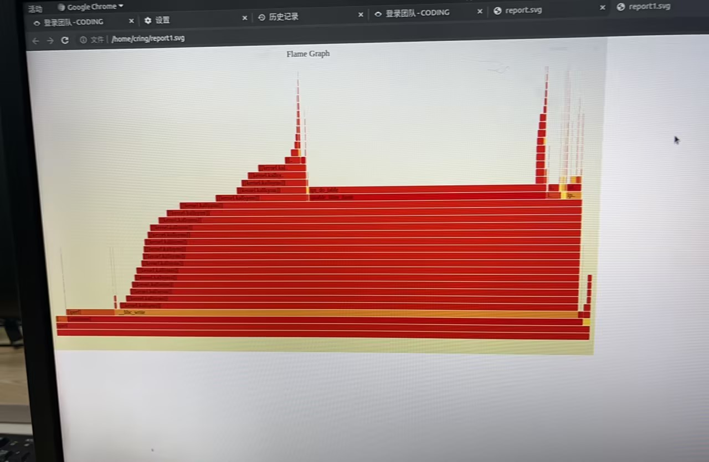
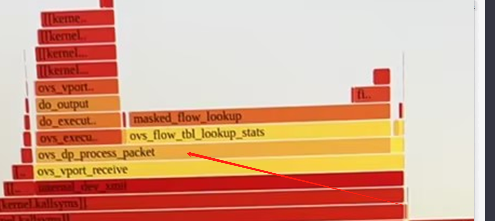
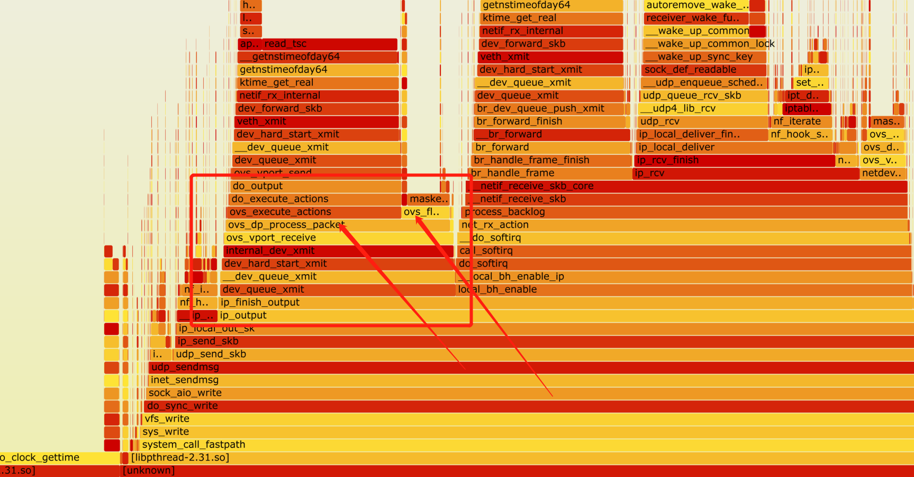
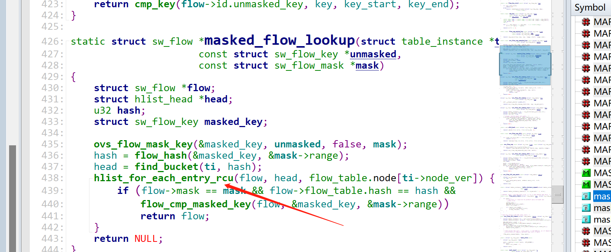

---kind:   - Troubleshootingproducts:    - Alauda Container Platform   - Alauda DevOps   - Alauda AI   - Alauda Application Services   - Alauda Service Mesh   - Alauda Developer PortalProductsVersion:   - 4.1.0,4.2.x---<!-- A type of document that involves encountering a fault, diag...it, performing root cause analysis, and providing solutions. --># 电科院x86平台万兆网卡，部署了underlay后性能会降低节点间udp带宽从6Gbits降至2Gbits 火焰图显示masked_flow_lookup时间增长 流量经过ovs内核报文处理逻辑## Cause- 节点IP配置在underlay的br-eth0(ovs internal类型)- 万兆网卡流量暴露ovs流表rcu机制性能问题## Resolution- 用overlay网络管理节点ip- underlay网络使用独立物理网卡## [workaround]## [Related Information]**Screenshots**- Environment: CNI v1.9.29/万兆网卡/underlay网络- br-eth0- ovs internal类型- ovs-dpctl dump-flows- masked_flow_lookup- rcu机制- Component: Kubernetes- Page ID: 176883148- Original Title: 电科院x86平台万兆网卡，部署了underlay后性能会降低