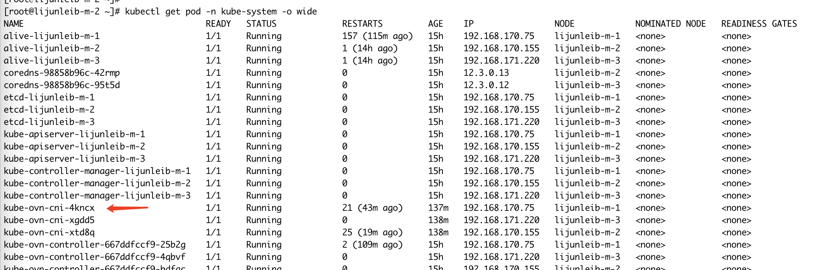
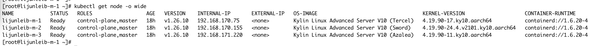
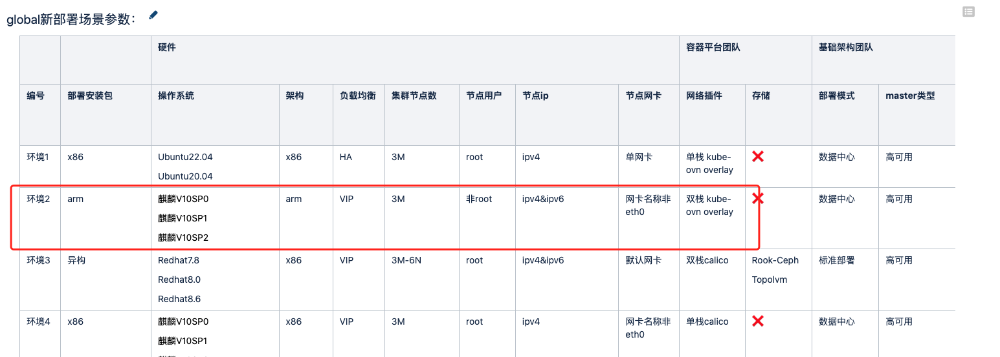
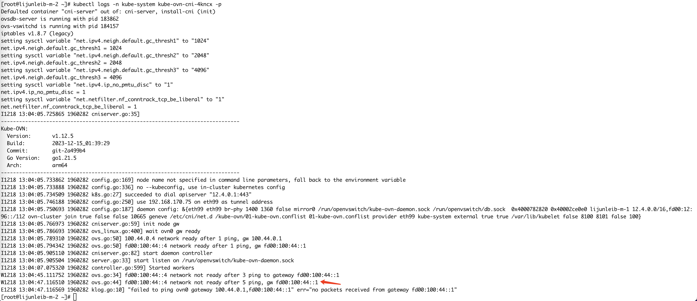
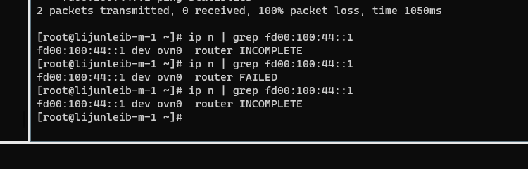
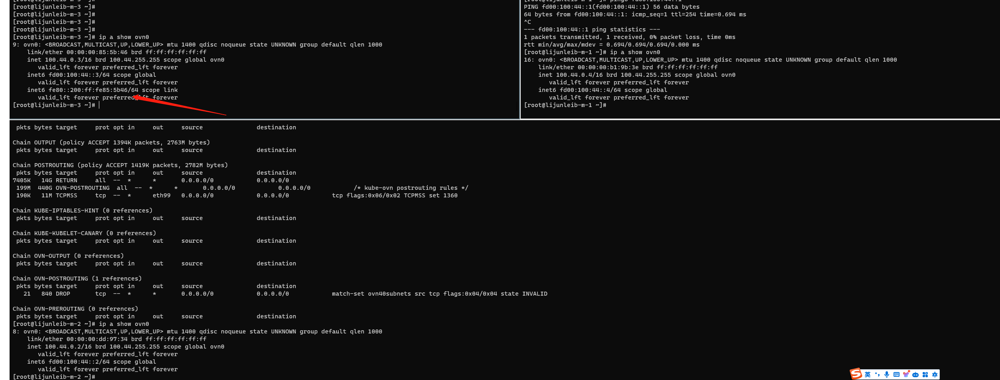
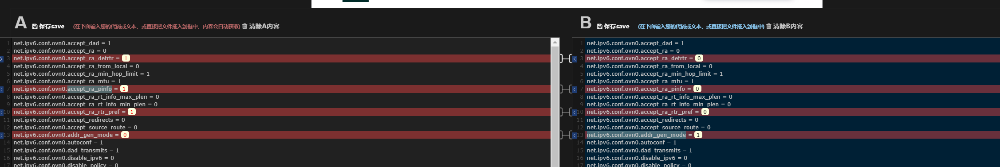
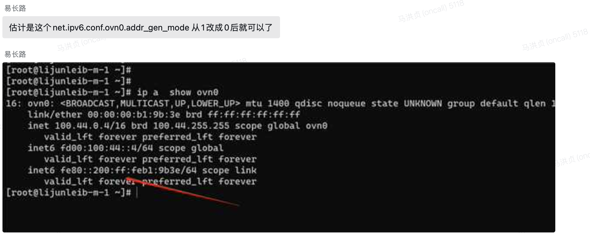
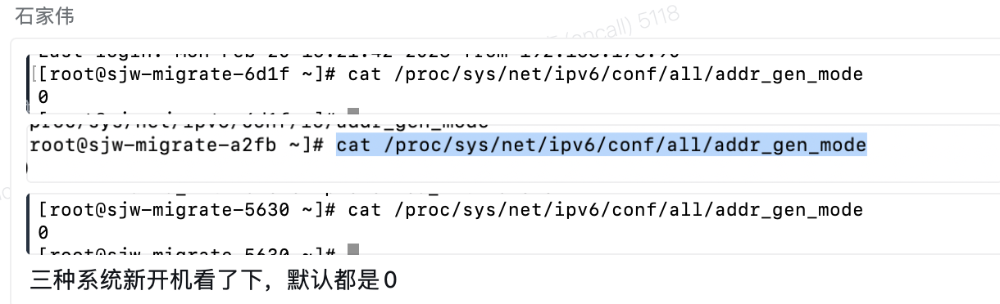
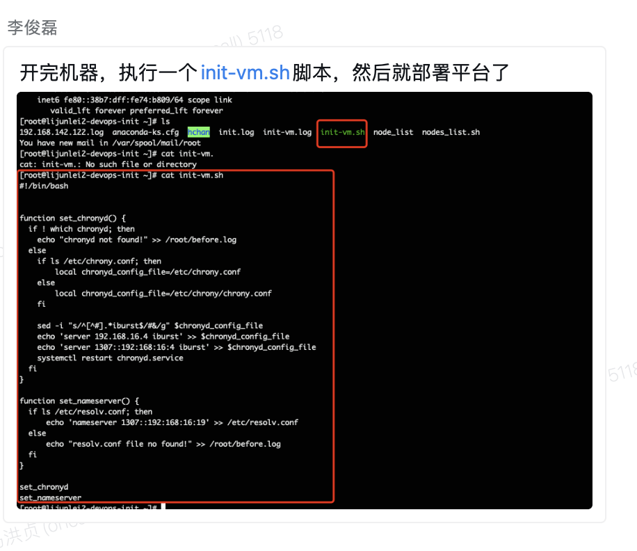

---kind:   - Troubleshootingproducts:    - Alauda Container Platform   - Alauda DevOps   - Alauda AI   - Alauda Application Services   - Alauda Service Mesh   - Alauda Developer PortalProductsVersion:   - 4.1.0,4.2.x---<!-- A type of document that involves encountering a fault, diag...it, performing root cause analysis, and providing solutions. --># ACP 3.15发版，kubekube-ovn-cni pod 不断 crash ovn0 网卡 IPv6 地址访问网关不通 异常节点 ovn0 网卡缺少 fe80 IPv6 地址## Cause- 异常节点 net.ipv6.conf.ovn0.addr_gen_mode 参数值异常（非0）## Resolution- 修改异常节点 sysctl 参数：sysctl -w net.ipv6.conf.ovn0.addr_gen_mode=0- 在集群部署代码中预设 net.ipv6.conf.ovn0.addr_gen_mode=0## [workaround]- 重建 ovs-ovn pod 可临时恢复（约10分钟）## [Related Information]**Screenshots**- Environment: Kylin OS, kube-ovn v1.12.5, ARM 架构, 双栈集群- kube-ovn-cni- ovn0- ovs-ovn- net.ipv6.conf.ovn0.addr_gen_mode- fe80::/64- OVN NB/SB- Component: Kubernetes- Page ID: 178226121- Original Title: ACP 3.15发版，kube-ovn-cni 不断 crash