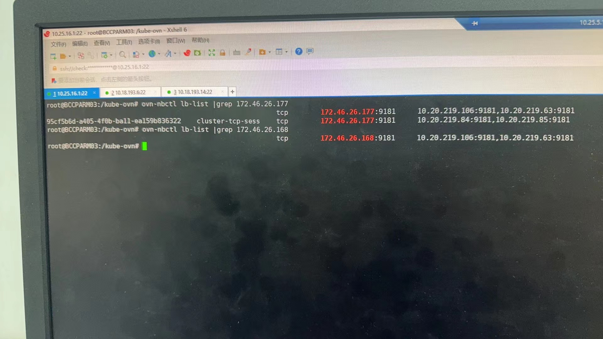
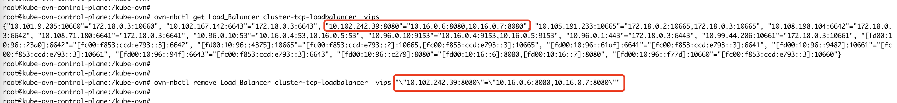
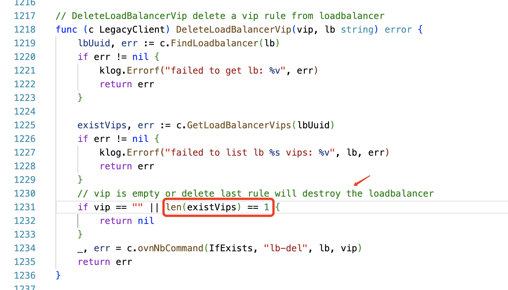

---
kind:
  - Troubleshooting
products:
  - Alauda Container Platform
  - Alauda DevOps
  - Alauda AI
  - Alauda Application Services
  - Alauda Service Mesh
  - Alauda Developer Portal
ProductsVersion:
  - 4.1.0,4.2.x
---
<!-- A type of document that involves encountering a fault, diagnosing it, performing root cause analysis, and providing solutions. -->

# 中原银行，kube

svc访问不通 同一个svc在两个load-balancer中存在记录

## Cause
- kube-ovn v1.8/1.9版本存在sessionAffinity: None时生成多余cluster-tcp-session-loadbalancer记录的bug

## Resolution
- 重建svc生成新vip
- 手动删除load-balancer多余记录
- 创建新svc设置sessionAffinity: ClientIP

## [workaround]
- 创建额外svc并设置sessionAffinity: ClientIP

## [Related Information]
**Screenshots**

- Environment: kube-ovn v1.8.14, ACP 3.6
- cluster-tcp-session-loadbalancer
- sessionAffinity配置
- kube-ovn-controller
- Component: kube-ovn
- Page ID: 178228393
- Original Title: 中原银行，kube-ovn svc 访问不通
