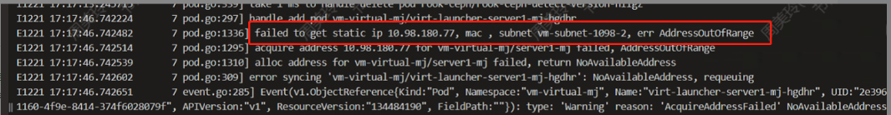
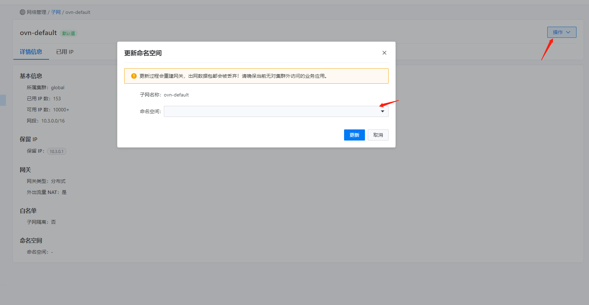
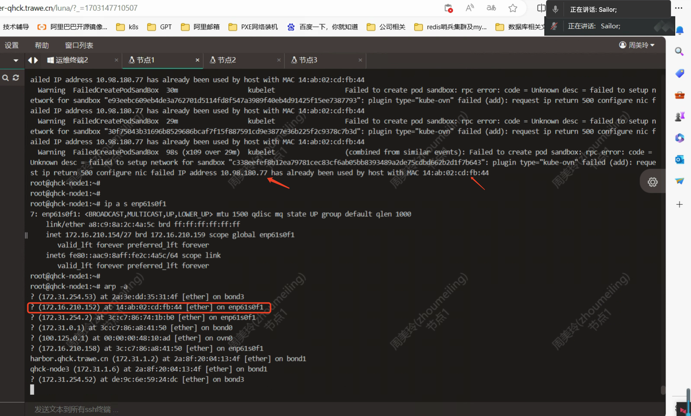

---
kind:
  - Troubleshooting
products:
  - Alauda Container Platform
  - Alauda DevOps
  - Alauda AI
  - Alauda Application Services
  - Alauda Service Mesh
  - Alauda Developer Portal
ProductsVersion:
  - 4.1.0,4.2.x
---
<!-- A type of document that involves encountering a fault, diagnosing it, performing root cause analysis, and providing solutions. -->

# 3.12 平台虚机扩容重启失败

无法分配IP地址 子网分配错误（IP被分配到非预期VLAN子网） MAC地址被占用导致Pod启动失败

## Cause
- 命名空间下存在多个子网labels导致随机分配
- IP地址10.98.180.77已被物理网卡占用

## Resolution
- 移除不需要的子网labels: kubectl edit ns <namespace>
- 释放被占用的IP地址10.98.180.77

## [workaround]

## [Related Information]
**Screenshots**

- Environment: 平台虚机扩容场景（Underlay网络）
- ovn-controller
- 子网配置
- kubectl get ns -oyaml
- VLAN子网划分（x.x.x.64/26和x.x.x.128/26）
- IP地址段冲突检测
- Component: kube-Ovn
- Page ID: 178228913
- Original Title: 3.12 平台虚机扩容重启失败
