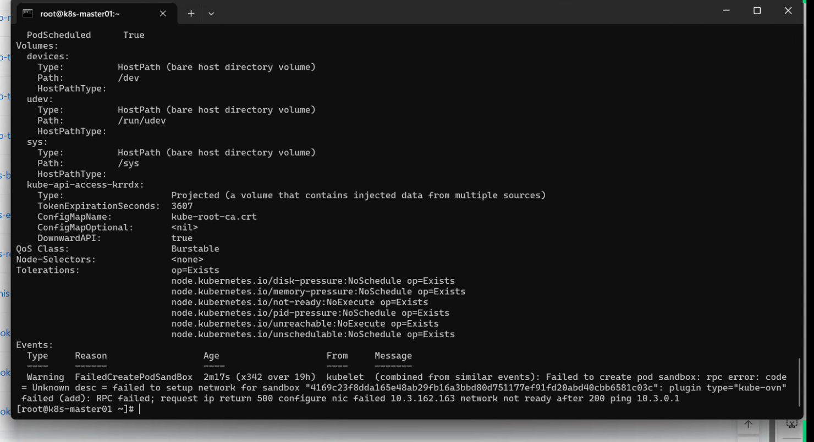
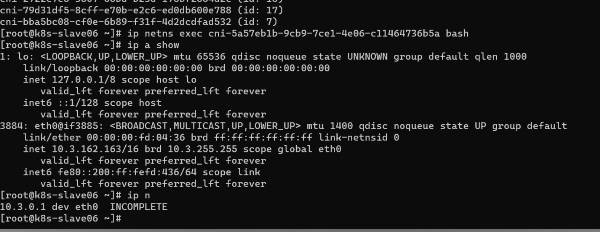
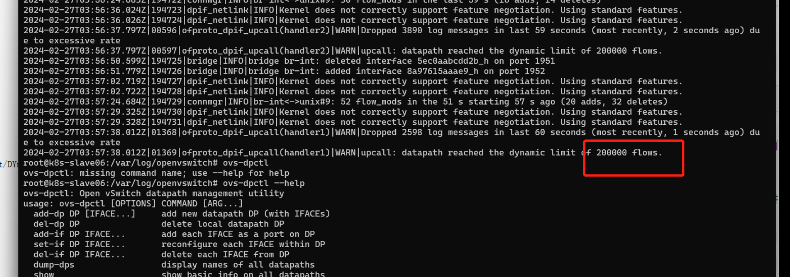
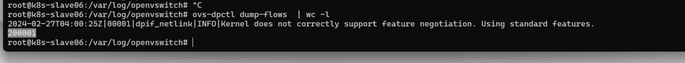

---kind:   - Troubleshootingproducts:    - Alauda Container Platform   - Alauda DevOps   - Alauda AI   - Alauda Application Services   - Alauda Service Mesh   - Alauda Developer PortalProductsVersion:   - 4.1.0,4.2.x---<!-- A type of document that involves encountering a fault, diag...it, performing root cause analysis, and providing solutions. --># overlay网络pod创建失败network not readypod创建失败报错network not ready pod内无法通过ARP获取网关10.3.0.1的MAC地址 ovs-vswitchd.log显示datapath数超过200000条## Cause- datapath流表数超过200000条导致网络异常## Resolution- 进入ovs-ovn pod执行命令: ovs-dpctl del-flows## [workaround]## [Related Information]**Screenshots**- Environment: CNI:kubeovn:v1.11.12- ovs-dpctl- kubeovn- ovs-vswitchd.log- 10.3.0.1- Component: Kubernetes- Page ID: 194052422- Original Title: overlay网络pod创建失败network not ready