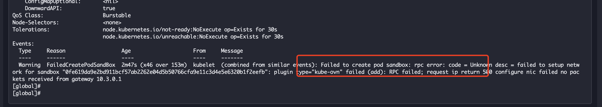

---
kind:
  - Troubleshooting
products:
  - Alauda Container Platform
  - Alauda DevOps
  - Alauda AI
  - Alauda Application Services
  - Alauda Service Mesh
  - Alauda Developer Portal
ProductsVersion:
  - 4.1.0,4.2.x
---
<!-- A type of document that involves encountering a fault, diagnosing it, performing root cause analysis, and providing solutions. -->

# 有状态副本集的pod无法正常启动，报错FailedCreatePodSandBox

overlay sts pod 创建失败 ping 网关失败，arp 无法获取

## Cause
- kube-ovn-controller 更新 logical_switch_port 时未保留 vendor/ls 字段
- commit 3552db38497ee97838b4c737ea515d2c218c422d 引入缺陷

## Resolution
- 应用修复补丁 https://github.com/kubeovn/kube-ovn/pull/3776

## [workaround]

## [Related Information]
**Screenshots**
,

- Environment: CNI 版本：kubeovn:v1.12.6
- kube-ovn-controller
- logical_switch_port
- external_ids.vendor
- external_ids.ls
- kubectl ko trace
- Component: kube-ovn
- Page ID: 194052488
- Original Title: 有状态副本集的pod无法正常启动，报错FailedCreatePodSandBox
