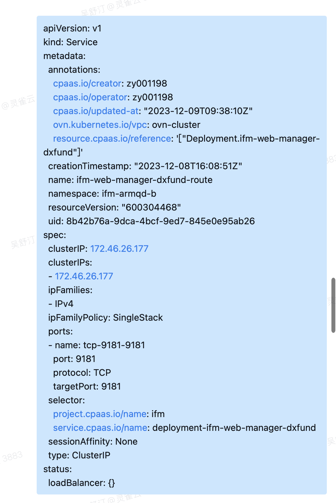

---
kind:
  - Troubleshooting
products:
  - Alauda Container Platform
  - Alauda DevOps
  - Alauda AI
  - Alauda Application Services
  - Alauda Service Mesh
  - Alauda Developer Portal
ProductsVersion:
  - 4.1.0,4.2.x
---
<!-- A type of document that involves encountering a fault, diagnosing it, performing root cause analysis, and providing solutions. -->

# 容器svc访问不通

容器svc访问不通，故障svc IP为172.46.26.177 ovn-nbctl lb-list显示故障svc在cluster-tcp-loadbalancer和cluster-tcp-sess各有一条记录 sessionAffinity显示为None但预期应为ClientIP

## Cause
- kube-ovn 1.8/1.9版本存在BUG：删除load-balancer最后一条vip记录时未正确清理记录
- 修改svc会话保持配置后残留vip记录

## Resolution
- 升级kube-ovn到已修复版本
- 执行清理残留vip记录操作：ovn-nbctl lb-del <load_balancer> <vip>

## [workaround]
- 创建新svc时开启会话保持并保持配置不删除

## [Related Information]
**Screenshots**

- Environment: 2.9.2 (对应kube-ovn 1.8/1.9版本)
- ovn-nbctl lb-list
- cluster-tcp-loadbalancer
- cluster-tcp-sess
- kube-ovn-controller
- sessionAffinity配置
- Component: kube-Ovn
- Page ID: 196906230
- Original Title: 容器平台-容器svc访问不通
