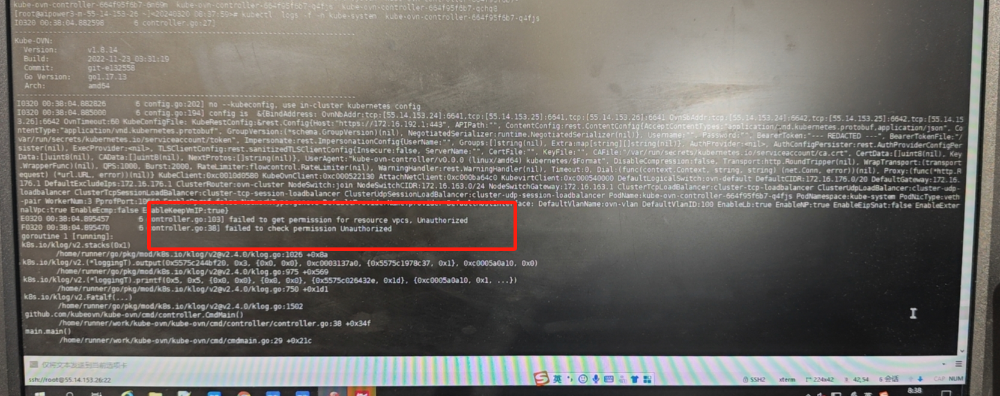
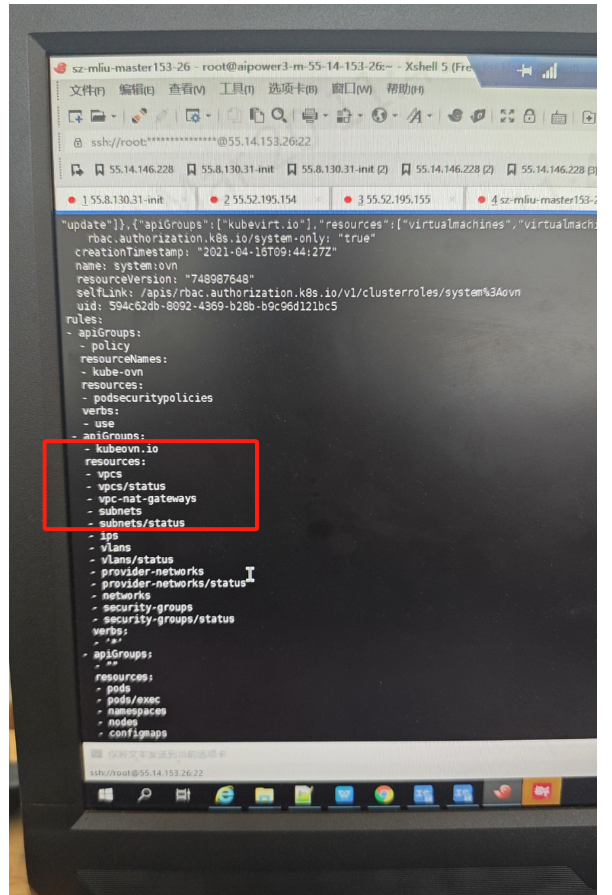
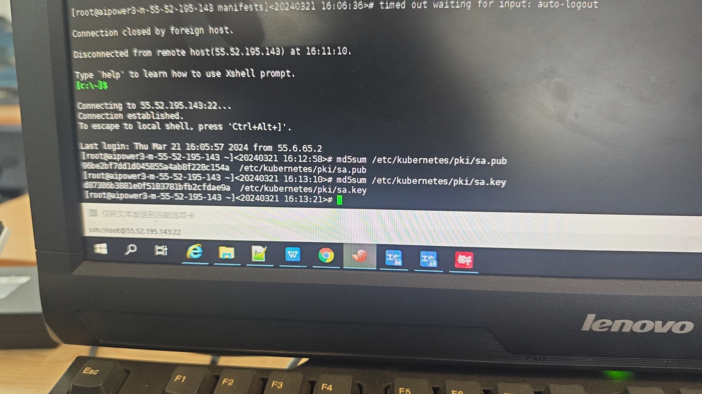
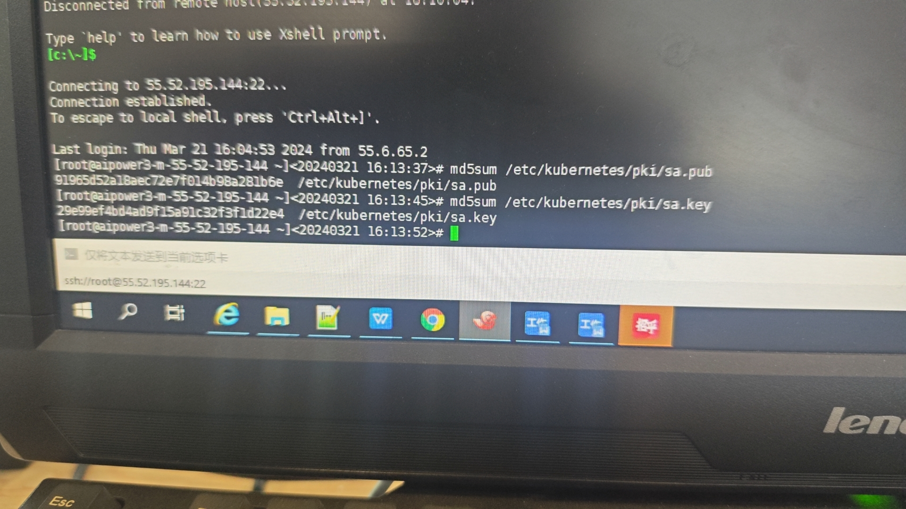

---kind:   - Troubleshootingproducts:    - Alauda Container Platform   - Alauda DevOps   - Alauda AI   - Alauda Application Services   - Alauda Service Mesh   - Alauda Developer PortalProductsVersion:   - 4.1.0,4.2.x---<!-- A type of document that involves encountering a fault, diag...it, performing root cause analysis, and providing solutions. --># 招商认证问题导致kubekube-ovn-controller 不断重启 rbac错误## Cause- 新增的master节点sa.pub和sa.key与老master节点不一致## Resolution- 替换新master节点的sa.pub和sa.key为老master节点的文件- 重启api-server## [workaround]## [Related Information]**Screenshots**- sa.pub- sa.key- api-server- kube-ovn-controller- rbac- Component: Kubernetes- Page ID: 198254621- Original Title: 招商认证问题导致kube-ovn-controller起不来