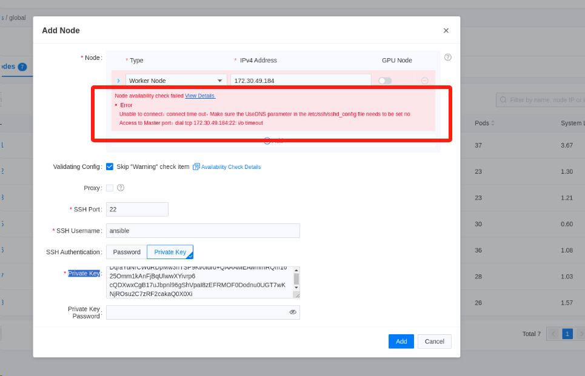
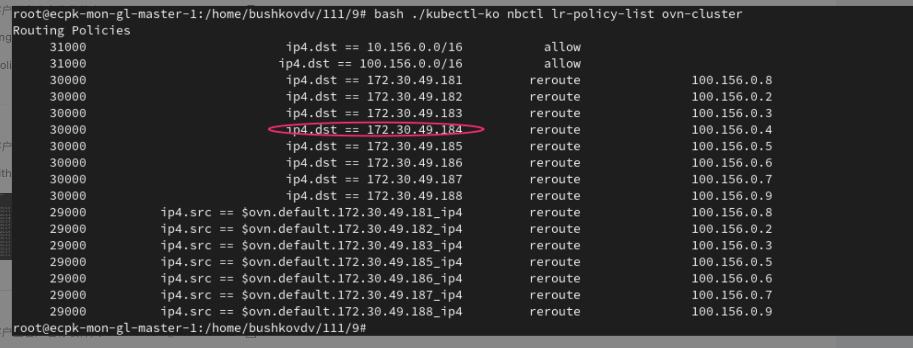

---kind:   - Troubleshootingproducts:    - Alauda Container Platform   - Alauda DevOps   - Alauda AI   - Alauda Application Services   - Alauda Service Mesh   - Alauda Developer PortalProductsVersion:   - 4.1.0,4.2.x---<!-- A type of document that involves encountering a fault, diag...it, performing root cause analysis, and providing solutions. --># 节点删除后无法重新加入集群节点删除后无法重新加入集群 添加节点时报错连接节点22端口超时## Cause- kube-ovn-controller leader运行于被删除节点- 节点删除时kube-ovn-controller未运行导致残留ovn lr policy route## Resolution- pod=`kubectl -n kube-system get pod -l app=ovs -o name | head -n1 | awk '{print $1}' | awk -F/ '{print $2}'`- kubectl cp -n kube-system $pod:/kube-ovn/kubectl-ko ./kubectl-ko- bash ./kubectl-ko nbctl lr-policy-list ovn-cluster | grep -w $NODE_IP- bash ./kubectl-ko nbctl lr-policy-del ovn-cluster 30000 "ip4.dst == $NODE_IP"- IPv6集群需替换ip4.dst为ip6.dst## [workaround]## [Related Information]**Screenshots**- Environment: ACP v3.16.0, Kube-OVN v1.12.x- kube-ovn-controller- ovn lr policy route- kubectl-ko- 22端口- 节点IP- Component: kube-Ovn- Page ID: 207400537- Original Title: 节点删除后无法重新加入集群