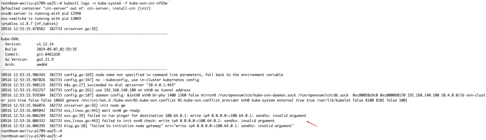
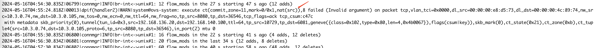
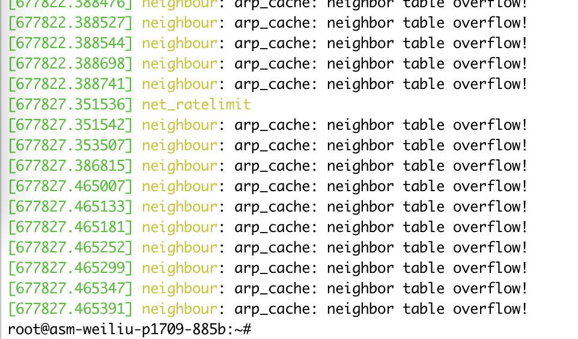
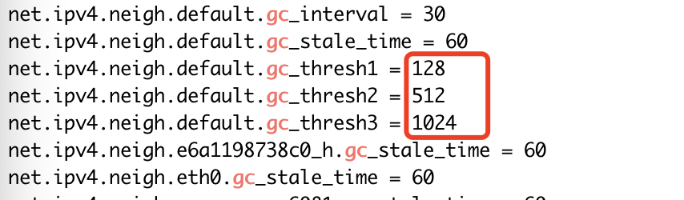

---kind:   - Troubleshootingproducts:    - Alauda Container Platform   - Alauda DevOps   - Alauda AI   - Alauda Application Services   - Alauda Service Mesh   - Alauda Developer PortalProductsVersion:   - 4.1.0,4.2.x---<!-- A type of document that involves encountering a fault, diag...it, performing root cause analysis, and providing solutions. --># asm 大规模测试环境，arp 表溢出问题当创建 400 个 服务的时候没报错，增加到 600 个服务时，监控节点上kube-ovn-cni crash 不正常了。 1、查看 kube-ovn-cni pod crash log 信息 结合 kube-ovn-cni pod 的log 报错，怀疑是系统参数哪里有问题## Cause## Resolution- ASM 反馈，在创建好的集群上添加了个节点，在节点上部署监控。- 如果把服务的数量降下去，kube-ovn-cni pod 又可以恢复正常。- ## 排查步骤- ## 解决方法- 改大相关的系统参数之后，环境恢复正常- 按照周瑜的说法，虚拟机模板不修改系统参数，就是要用默认值。如果是 性能测试，需要修改的参数，写入到性能测试文档和性能测试报告文档中，由客户自己去修改。## [workaround]## [Related Information]**Screenshots**- 2024- 17- /proc/sys/net/ipv4/neigh/default/gc- pod- 12- 400- 600- 14- 55- 16- Component: Kubernetes- Page ID: 210436448- Original Title: asm 大规模测试环境，arp 表溢出问题