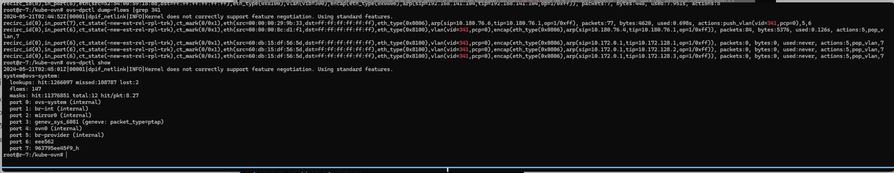
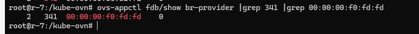
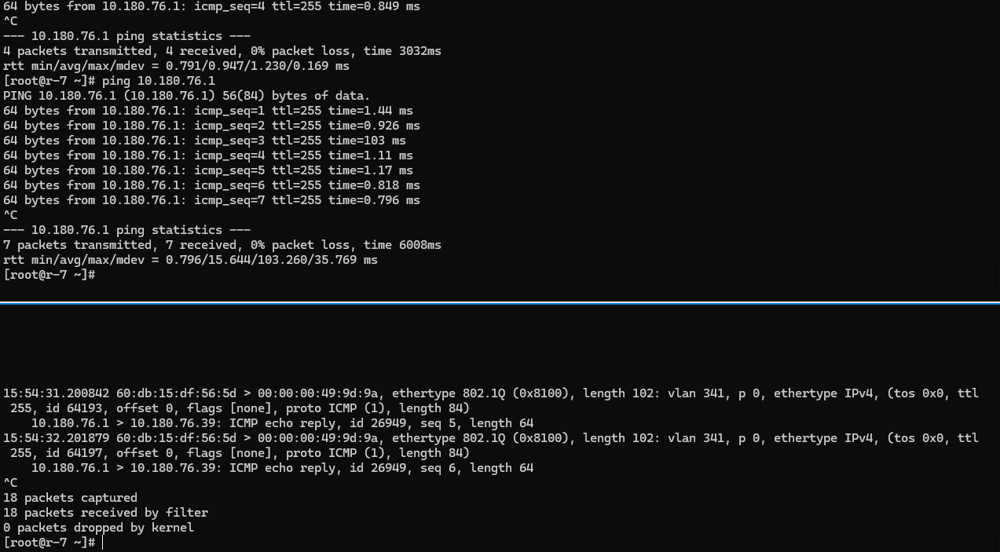
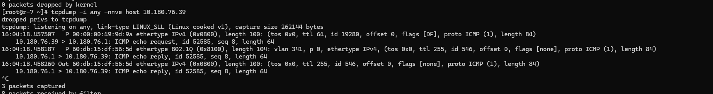
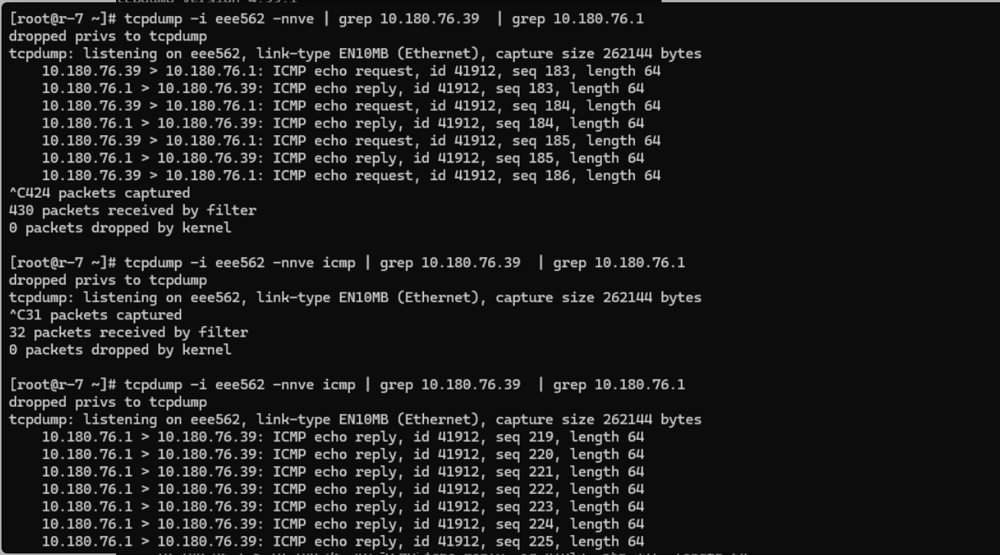
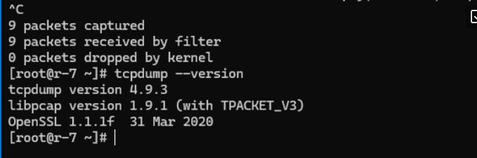

---kind:   - Troubleshootingproducts:    - Alauda Container Platform   - Alauda DevOps   - Alauda AI   - Alauda Application Services   - Alauda Service Mesh   - Alauda Developer PortalProductsVersion:   - 4.1.0,4.2.x---<!-- A type of document that involves encountering a fault, diag...it, performing root cause analysis, and providing solutions. --># 麒麟环境tcpdump 抓包的bugunderlay pod 启动失败 pod无法ping通网关 tcpdump -i {物理网卡} arp and host {podip} 未抓到arp报文## Cause- 麒麟内核或网卡驱动问题导致流量路径异常- 特定版本tcpdump解析icmp过滤条件存在缺陷## Resolution- 迁移虚机到其他物理节点- 检查物理环境配置（交换机/节点）## [workaround]- 使用无过滤条件的tcpdump命令抓包（如 tcpdump -i {网卡}）## [Related Information]**Screenshots**- Environment: 麒麟Linux 4.19.90-24.4.v2101.ky10.x86_64, kube-ovn v1.12.8- kube-ovn v1.12.8- tcpdump- arp- icmp- 物理网卡- ovn db- datapath- fdb- Component: Kubernetes- Page ID: 210437701- Original Title: 麒麟环境tcpdump 抓包的bug