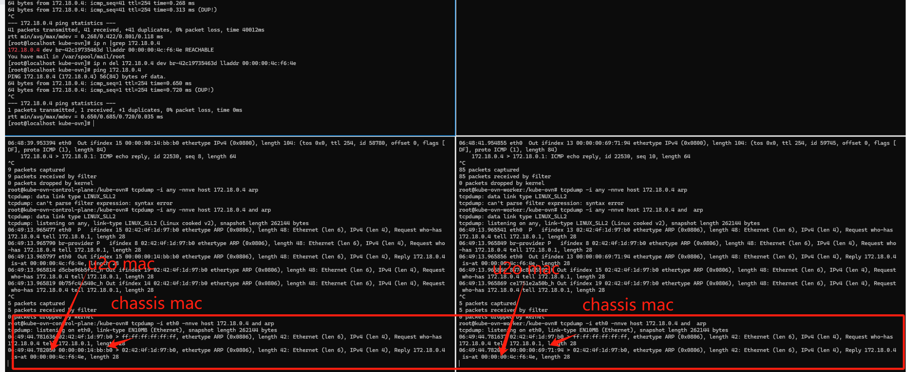
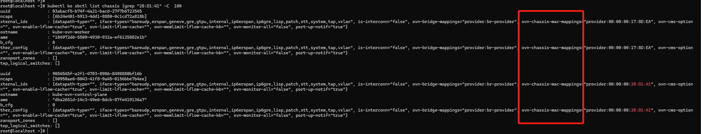
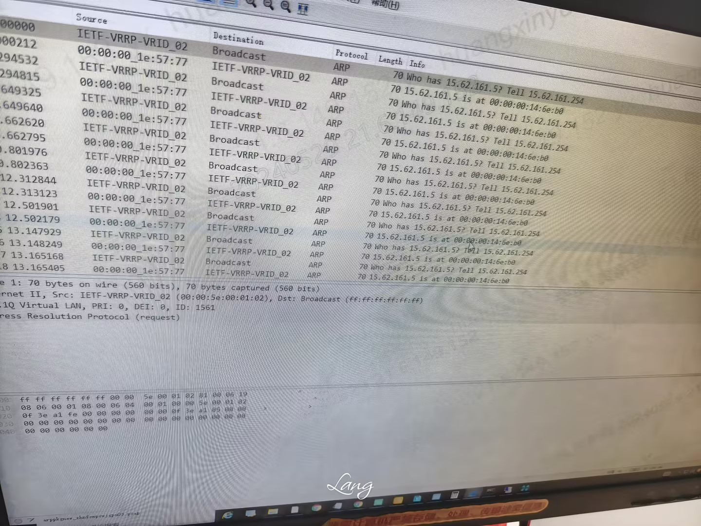
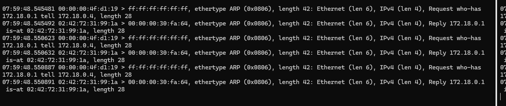

---kind:   - Troubleshootingproducts:    - Alauda Container Platform   - Alauda DevOps   - Alauda AI   - Alauda Application Services   - Alauda Service Mesh   - Alauda Developer PortalProductsVersion:   - 4.1.0,4.2.x---<!-- A type of document that involves encountering a fault, diag...it, performing root cause analysis, and providing solutions. --># 中信客户交换机上 u2oIP 一直在漂移交换机报警u2oIP持续漂移 所有节点响应u2oIP的ARP请求导致不同交换机端口返回 不同节点的ARP响应源MAC不同（来自ovn-chassis-mac-mappings）## Cause- 集群外发起的u2oIP ARP请求触发所有节点响应- u2o的lrp主动发送ARP请求获取物理网卡MAC## Resolution- 添加OpenFlow规则: ovs-ofctl add-flow {underlay网桥} "priority=10000,in_port=1,arp,arp_spa={物理网关ip},arp_tpa={u2oIP},arp_op=1,actions=drop"## [workaround]## [Related Information]**Screenshots**- Environment: CNI: kube-ovn v1.9.26- u2oIP- kube-ovn- ovn-chassis-mac-mappings- lrp- mac_binding表- arp_spa- arp_tpa- ovs-ofctl- Component: Kubernetes- Page ID: 211783604- Original Title: 中信客户交换机上 u2oIP 一直在漂移