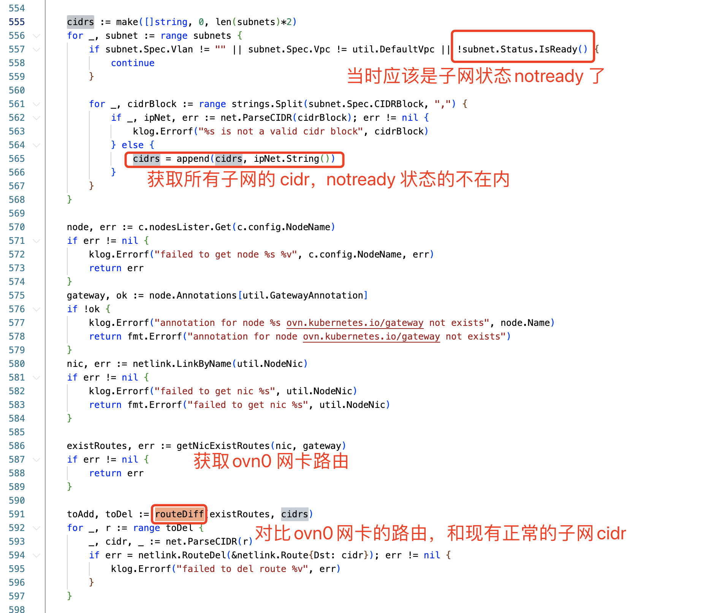

---kind:   - Troubleshootingproducts:    - Alauda Container Platform   - Alauda DevOps   - Alauda AI   - Alauda Application Services   - Alauda Service Mesh   - Alauda Developer PortalProductsVersion:   - 4.1.0,4.2.x---<!-- A type of document that involves encountering a fault, diag...it, performing root cause analysis, and providing solutions. --># 宝信 kubekube-ovn-cni pod 不断 crash 业务 pod 网络受影响 IPv6 路由异常无法自动恢复## Cause- IPv6 路由处理存在缺陷- 路由删除后无法自动重建## Resolution- 手动添加 IPv6 路由- 重新配置 ovn0 网卡 IPv6 地址触发路由生成## [workaround]- 重启 master 节点和 worker 节点## [Related Information]**Screenshots**- Environment: Kylin OS(arm), kube-ovn v1.9.27, 双栈- kube-ovn-cni- ovn0- IPv6 路由- 双栈环境- 子网 CIDR- Component: Kubernetes- Page ID: 214860267- Original Title: 宝信 kube-ovn-cni pod crash 问题