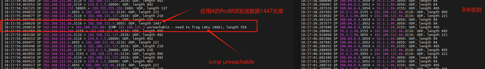

---kind:   - Troubleshootingproducts:    - Alauda Container Platform   - Alauda DevOps   - Alauda AI   - Alauda Application Services   - Alauda Service Mesh   - Alauda Developer PortalProductsVersion:   - 4.1.0,4.2.x---<!-- A type of document that involves encountering a fault, diag...it, performing root cause analysis, and providing solutions. --># 偶现 UDP 丢包UDP 丢包 ICMP need to frag 包## Cause- underlay 与 overlay MTU 不一致- UDP 包大小介于 overlay MTU(1400) ~ underlay MTU(1500) 之间且带 DF 标记## Resolution- 在 underlay pod 添加 init container 执行 sysctl net.ipv4.ip_no_pmtu_disc=1## [workaround]- 修改应用程序实现 ICMP need to frag 时重发## [Related Information]**Screenshots**- MTU- net.ipv4.ip_no_pmtu_disc- metallb vip- underlay pod- overlay pod- Component: Kubernetes- Page ID: 217547305- Original Title: 偶现 UDP 丢包