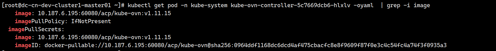
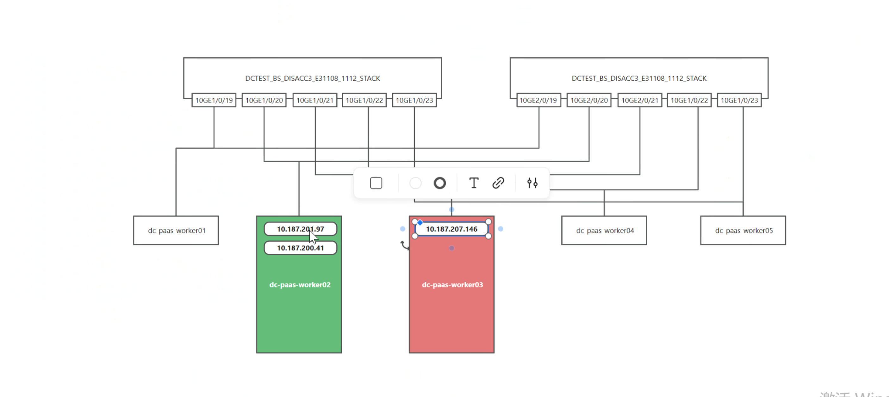
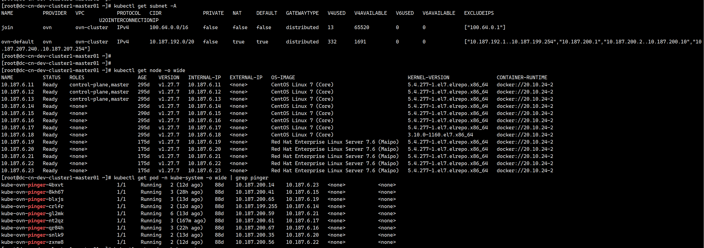
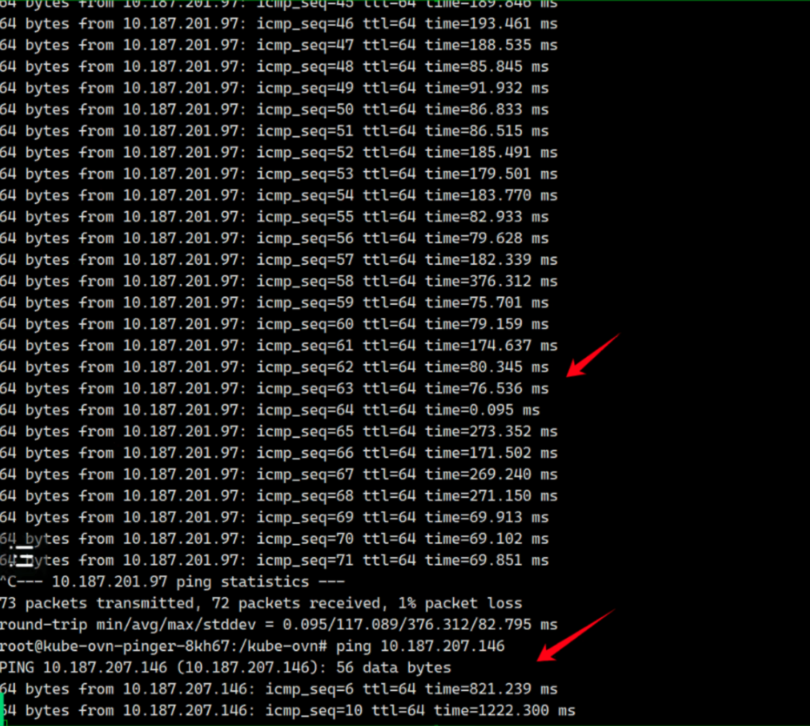
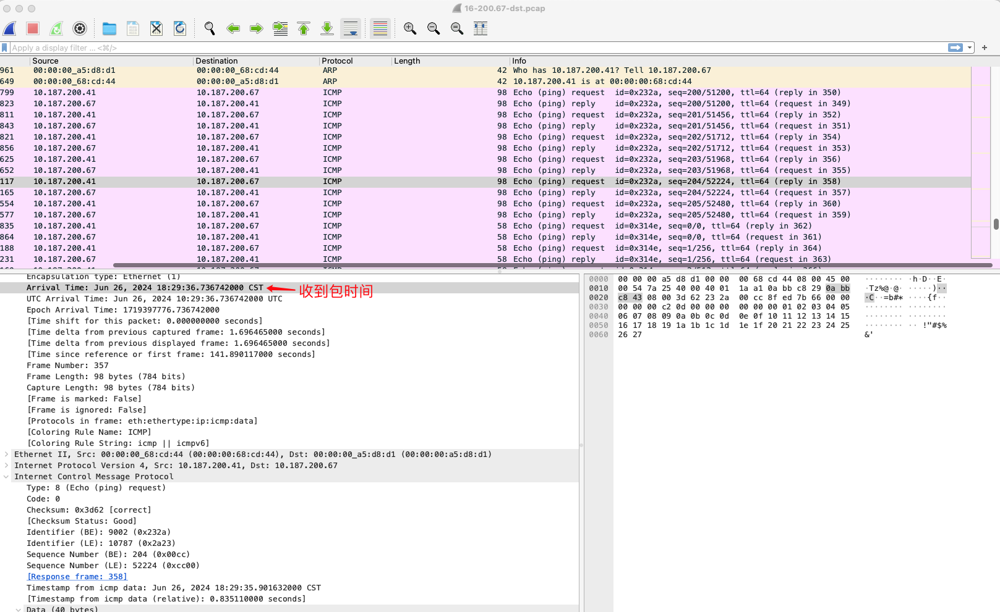
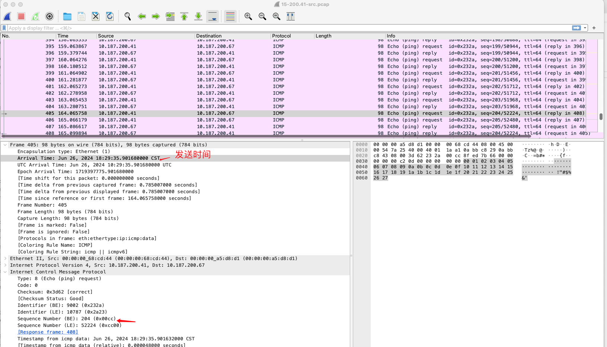
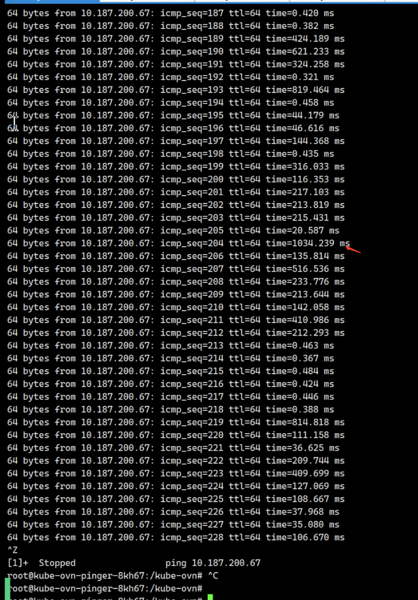
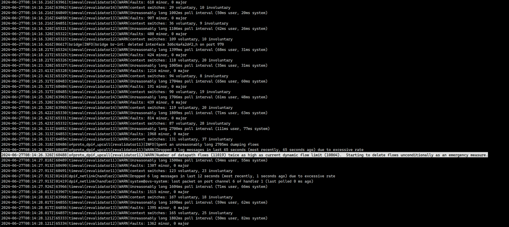
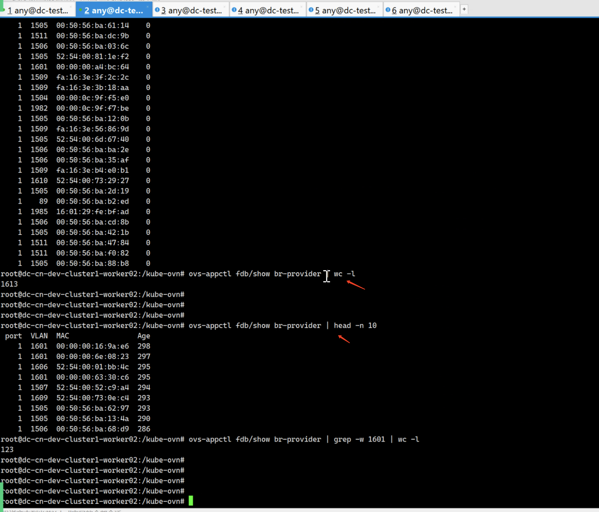
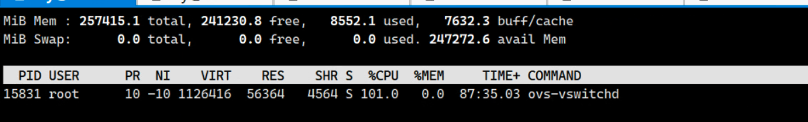

---kind:   - Troubleshootingproducts:    - Alauda Container Platform   - Alauda DevOps   - Alauda AI   - Alauda Application Services   - Alauda Service Mesh   - Alauda Developer PortalProductsVersion:   - 4.1.0,4.2.x---<!-- A type of document that involves encountering a fault, diag...it, performing root cause analysis, and providing solutions. --># 国泰君安 underlay网络延迟导致数据服务pod 选主失败跨节点pod间访问超时 物理机节点出现网络问题 ICMP报文在underlay网卡到pod段丢包## Cause- 交换机未正确过滤VLAN 1601报文导致网络延迟## Resolution- 修改交换机配置仅允许vlan 1601报文通过## [workaround]## [Related Information]**Screenshots**- Environment: Kubernetes (CNI: kube-ovn v1.11.15, ACP 3.14.2)- vlan 1601- kube-ovn- ovs-vswitchd- br-provider- em2物理网卡- Component: Kubernetes- Page ID: 219087251- Original Title: 国泰君安 underlay网络延迟导致数据服务pod 选主失败