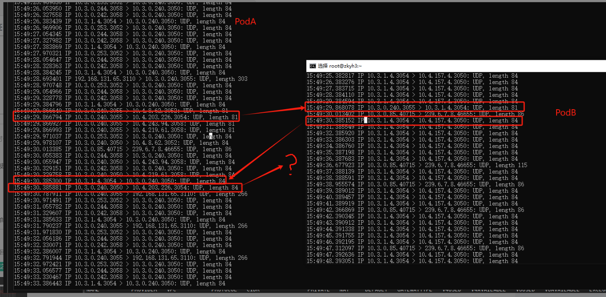
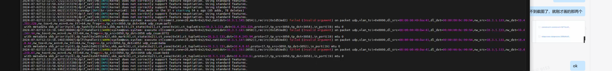
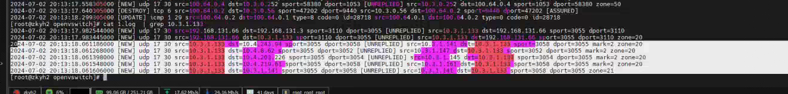

---kind:   - Troubleshootingproducts:    - Alauda Container Platform   - Alauda DevOps   - Alauda AI   - Alauda Application Services   - Alauda Service Mesh   - Alauda Developer PortalProductsVersion:   - 4.1.0,4.2.x---<!-- A type of document that involves encountering a fault, diag...it, performing root cause analysis, and providing solutions. --># 中科宇航 udp丢包Pod A发送到Pod B Cluster IP的第三个报文（src port 3050）被丢弃 ovs-vswitchd日志显示conntrack建立失败 conntrack事件仅记录第一个报文生成条目## Cause- 第三个报文生成的conntrack五元组与已有条目冲突- 内核生成的reply方向conntrack与后续报文冲突## Resolution- 关闭kube-ovn的enable-lb选项（触发SNAT问题未被客户接受）- 调整应用端口避免冲突（客户不接受改动）## [workaround]## [Related Information]**Screenshots**- Environment: CNI: kube-ovn v1.11.4- kube-ovn- conntrack- ovs-vswitchd- 10.3.0.240:3055- 10.4.203.226:3054- 10.3.1.4:3054- 10.4.157.4:3050- Component: Kubernetes- Page ID: 219088984- Original Title: 中科宇航 udp丢包