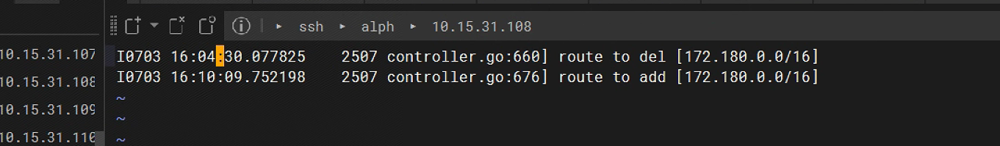
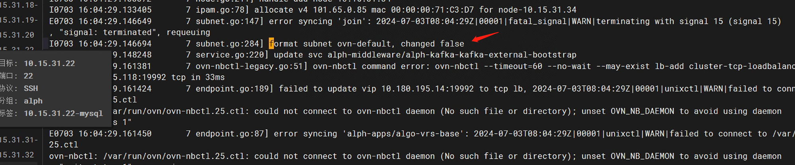

---kind:   - Troubleshootingproducts:    - Alauda Container Platform   - Alauda DevOps   - Alauda AI   - Alauda Application Services   - Alauda Service Mesh   - Alauda Developer PortalProductsVersion:   - 4.1.0,4.2.x---<!-- A type of document that involves encountering a fault, diag...it, performing root cause analysis, and providing solutions. --># 真点科技subnet not ready导致所有Pod 访问外网失败集群内所有Pod访问外网失败 ovs-db重新选主日志大量出现 subnet的status出现SetLogicalSwitchConfigFailed状态## Cause- master节点磁盘同步操作引发ovn db不稳定- subnet变更操作失败导致路由丢失## Resolution- 应用kube-ovn社区PR#4258修复补丁## [workaround]## [Related Information]**Screenshots**- Environment: CNI版本:kube-ovn 1.9.27- kube-ovn-cni.log- kube-ovn-controller.log- ovn db- subnet资源yaml- SetLogicalSwitchConfigFailed- Component: kube-ovn- Page ID: 219090284- Original Title: 真点科技subnet not ready导致所有Pod 访问外网失败