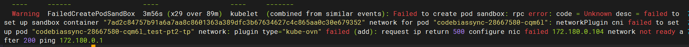
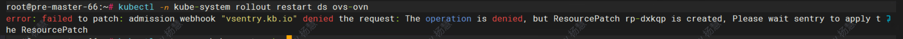
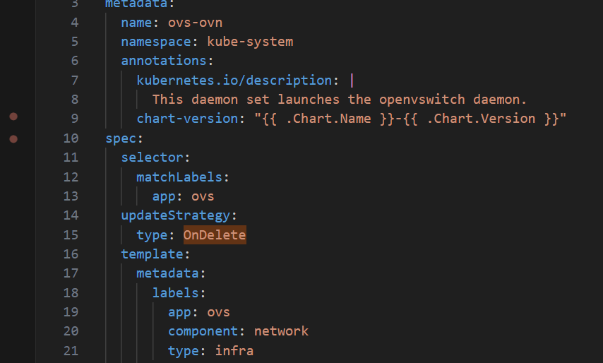

---kind:   - Troubleshootingproducts:    - Alauda Container Platform   - Alauda DevOps   - Alauda AI   - Alauda Application Services   - Alauda Service Mesh   - Alauda Developer PortalProductsVersion:   - 4.1.0,4.2.x---<!-- A type of document that involves encountering a fault, diag...it, performing root cause analysis, and providing solutions. --># 真点科技在将master 节点迁移到其他master节点后，新增的Pod 启动不了。新增Pod启动失败## Cause- kube-ovn组件ovs-ovn pod未正确重启- DaemonSet的updateStrategy设置为OnDelete导致rollout restart无效## Resolution- 手动删除ovs-ovn pod触发重建- kubectl delete pod -n kube-system -l app=ovs-ovn## [workaround]## [Related Information]**Screenshots**- Environment: CNI:kube-ovn 1.9.27- kube-ovn- ovs-ovn- updateStrategy- kubectl rollout restart- DaemonSet- Component: Kubernetes- Page ID: 219090303- Original Title: 真点科技在将master 节点迁移到其他master节点后，新增的Pod 启动不了。