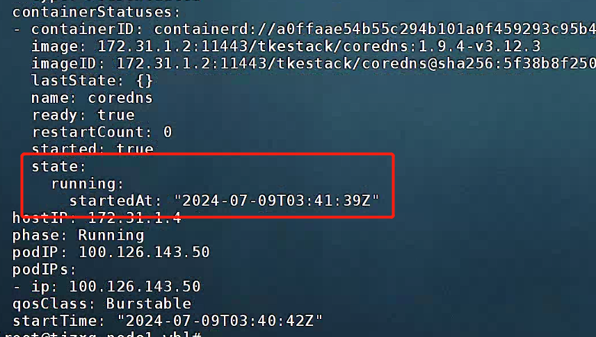
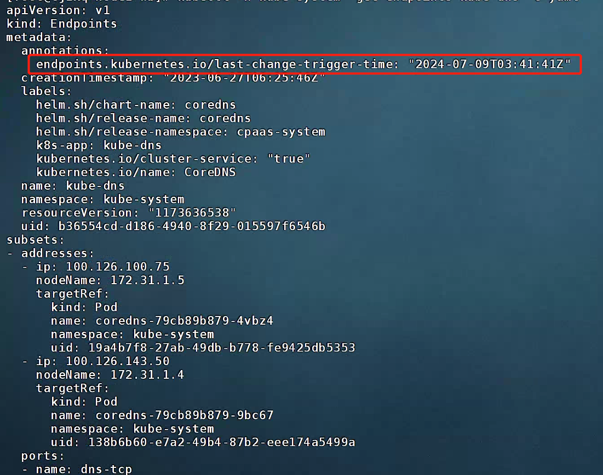
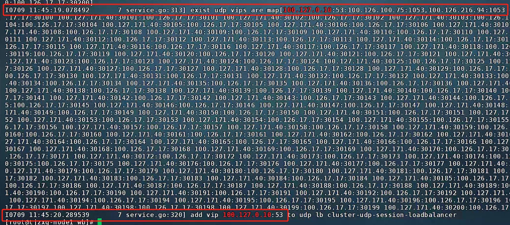
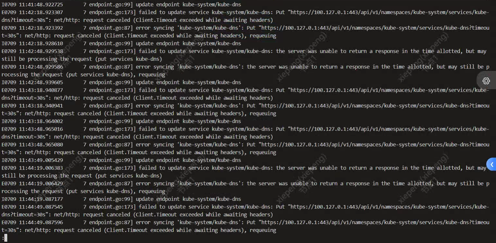

---kind:   - Troubleshootingproducts:    - Alauda Container Platform   - Alauda DevOps   - Alauda AI   - Alauda Application Services   - Alauda Service Mesh   - Alauda Developer PortalProductsVersion:   - 4.1.0,4.2.x---<!-- A type of document that involves encountering a fault, diag...it, performing root cause analysis, and providing solutions. --># 单节点掉电故障后，域名解析恢复时间过长域名解析恢复时间过长 coredns pod 恢复后数分钟才正常## Cause- kube-ovn-controller 更新 svc annotations 失败导致 ovn lb 未更新## Resolution- 禁用 ovn lb- 修改 kube-ovn 代码将更新 svc annotations 放到最后处理(https://github.com/kubeovn/kube-ovn/pull/4280)## [workaround]- 临时禁用 ovn lb## [Related Information]**Screenshots**- kube-ovn-controller- coredns- ovn lb- svc annotations- Component: kube-ovn- Page ID: 221873417- Original Title: 单节点掉电故障后，域名解析恢复时间过长