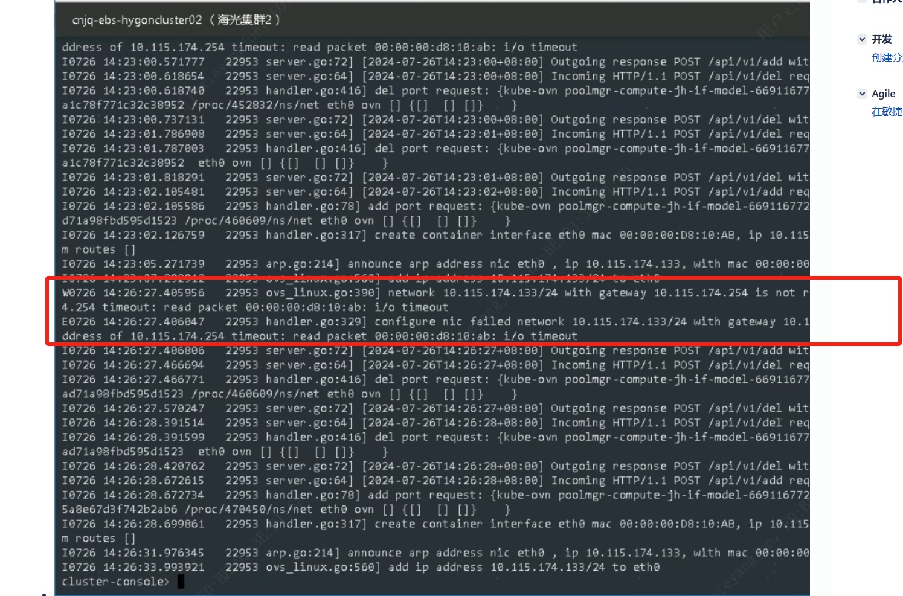
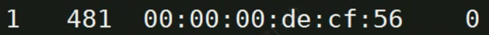

---kind:   - Troubleshootingproducts:    - Alauda Container Platform   - Alauda DevOps   - Alauda AI   - Alauda Application Services   - Alauda Service Mesh   - Alauda Developer PortalProductsVersion:   - 4.1.0,4.2.x---<!-- A type of document that involves encountering a fault, diag...it, performing root cause analysis, and providing solutions. --># underlay 环境Pod 创建失败Pod 创建失败，报到达网关不通 从 underlay pod 的 namespace 发出的报文未到达物理网卡 ovs-appctl fdb/show 显示流表只有一个## Cause- ovs 状态异常导致流表不正确## Resolution- 重启 ovs-ovn pod## [workaround]## [Related Information]**Screenshots**- Environment: ACP 3.14.2- ovs-vswitch.log- ovn-controller.log- ovs-appctl fdb/show- ovs-ovn pod- Component: Kubernetes- Page ID: 224657598- Original Title: underlay 环境Pod 创建失败