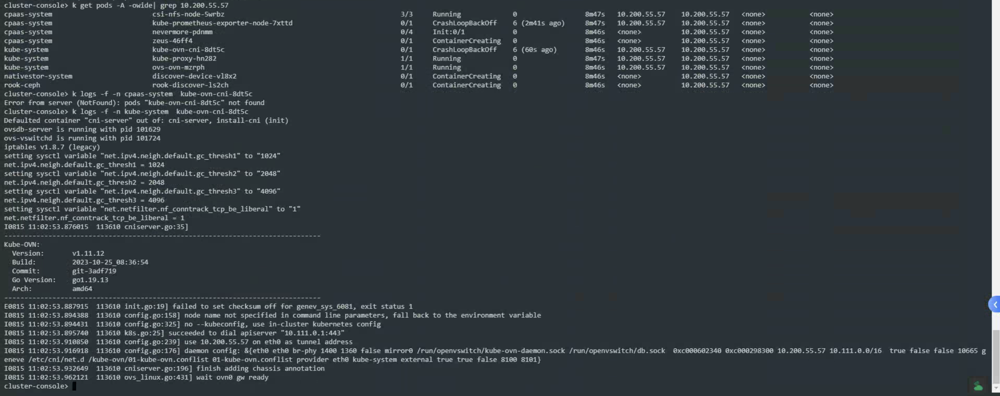
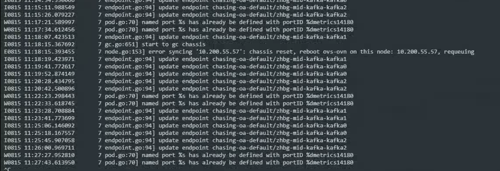
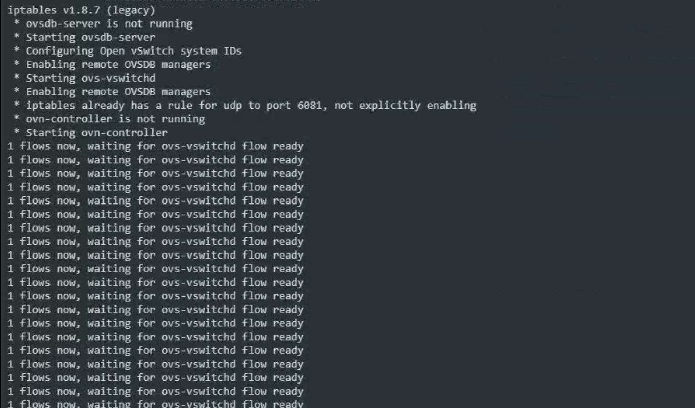
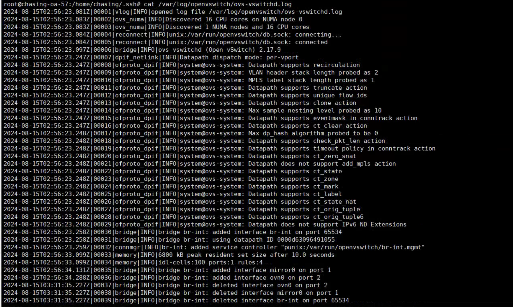
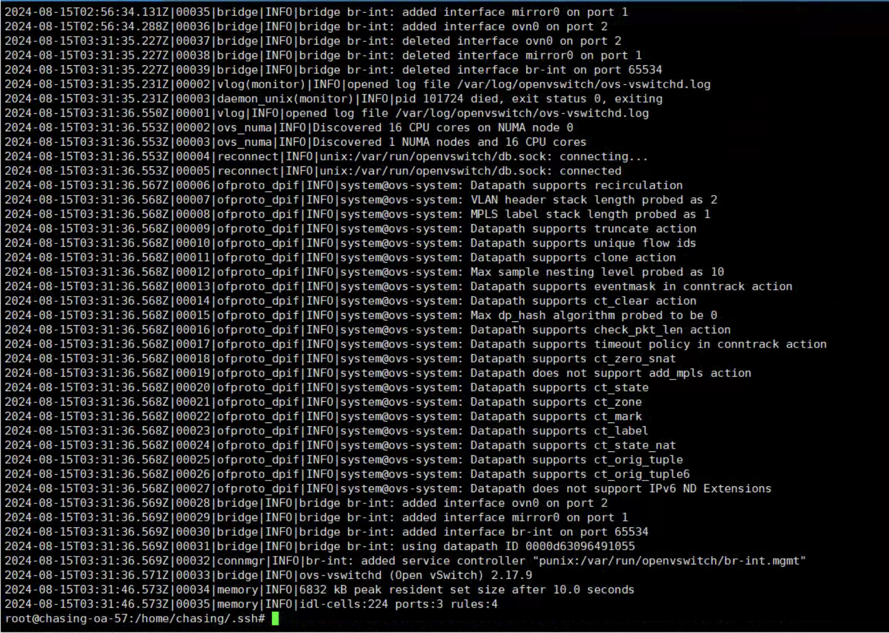
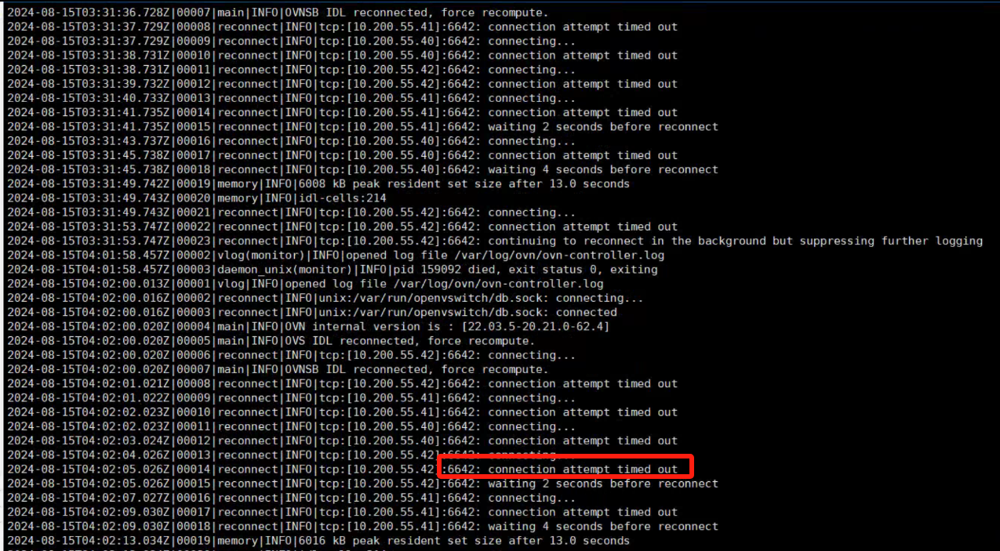

---
kind:
  - Troubleshooting
products:
  - Alauda Container Platform
  - Alauda DevOps
  - Alauda AI
  - Alauda Application Services
  - Alauda Service Mesh
  - Alauda Developer Portal
ProductsVersion:
  - 4.1.0,4.2.x
---
<!-- A type of document that involves encountering a fault, diagnosing it, performing root cause analysis, and providing solutions. -->

# 新增节点

kube-ovn-cni服务pod无法启动 ovn-controller日志报错同步10.200.55.57时出现错误 ovn-ovs日志报错'1 flows now, waiting for ovs-vswitchd flow ready'

## Cause
- 新增节点与master节点间6642端口通信不通

## Resolution
- 开通问题节点与集群master节点的6642端口通信

## [workaround]

## [Related Information]
**Screenshots**

- Environment: 3.14.2
- kube-ovn-cni
- ovn-controller
- ovs-vswitchd
- 6642/tcp
- Component: kube-Ovn
- Page ID: 227249181
- Original Title: 新增节点-kube-ovn-cni服务pod无法启动
