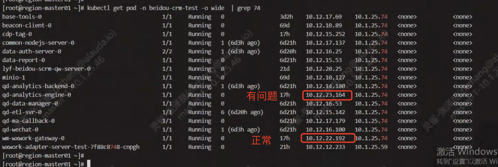

---kind:   - Troubleshootingproducts:    - Alauda Container Platform   - Alauda DevOps   - Alauda AI   - Alauda Application Services   - Alauda Service Mesh   - Alauda Developer PortalProductsVersion:   - 4.1.0,4.2.x---<!-- A type of document that involves encountering a fault, diag...it, performing root cause analysis, and providing solutions. --># 来伊份_underlay环境，pod 创建耗时特别长pod 创建耗时特别长（约37分钟） 相同时间重启的pod中一个正常启动，另一个启动耗时特别长 ovn-controller日志显示时间对应异常## Cause- 网关未响应pod的arp请求## Resolution- 联系客户IAAS查看网关配置## [workaround]## [Related Information]**Screenshots**- Environment: CNI: kube-ovn 1.9.27, ACP 3.12.1- kube-ovn-cni- ovn-controller- arping -c3 -C1 -i1 -I $nicName $gateway- 网关配置- Component: Kubernetes- Page ID: 231116173- Original Title: 来伊份_underlay环境，pod 创建耗时特别长