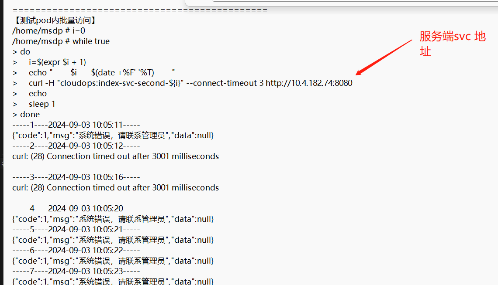
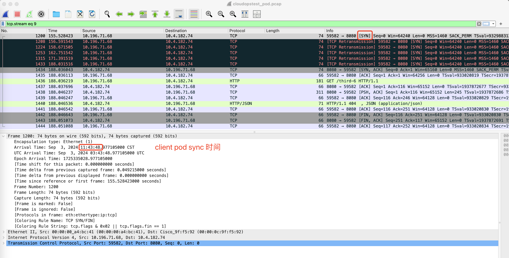
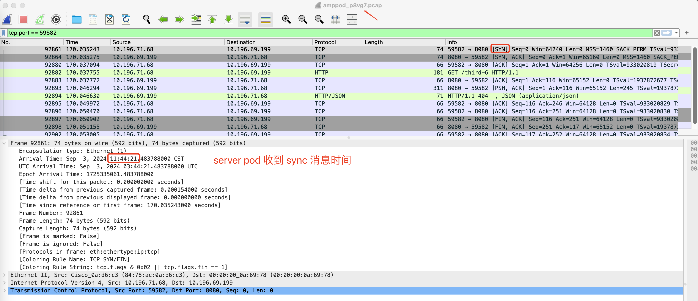
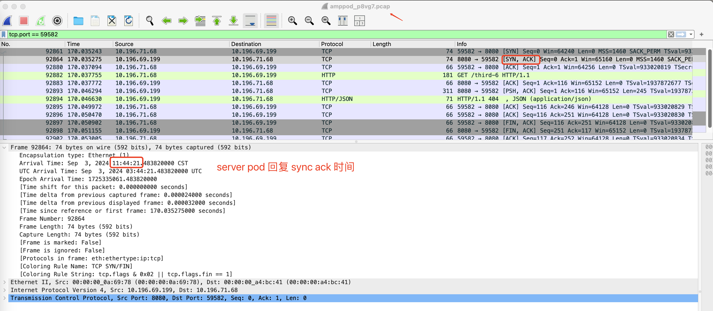
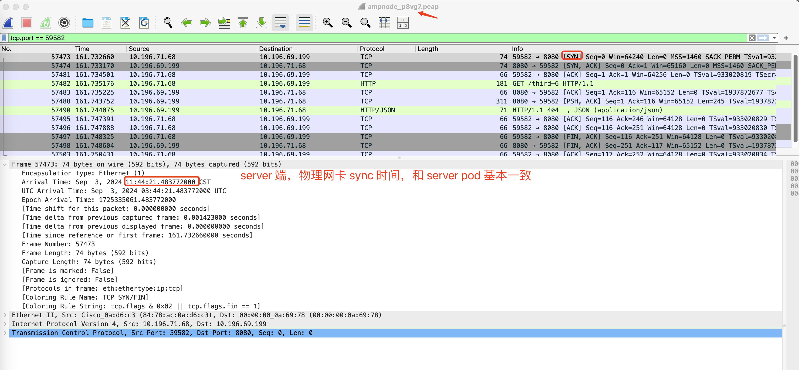
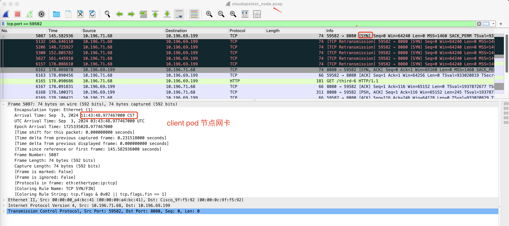

---kind:   - Troubleshootingproducts:    - Alauda Container Platform   - Alauda DevOps   - Alauda AI   - Alauda Application Services   - Alauda Service Mesh   - Alauda Developer PortalProductsVersion:   - 4.1.0,4.2.x---<!-- A type of document that involves encountering a fault, diag...it, performing root cause analysis, and providing solutions. --># 郑州银行，应用访问svc ip+port连接超时，同时解析svc地址解析会失败应用pod解析跨ns的svc失败 直接访问svc ip+port连接超时 去掉超时限制后响应耗时30s+## Cause- 报文在网关转发到对端pod存在延迟## Resolution- 协调iaas团队排查底层网络## [workaround]## [Related Information]**Screenshots**- Environment: CNI: kube-ovn underlay, ACP 3.12.3- kube-ovn- svc ip- pod网络- 网关- Component: Kubernetes- Page ID: 231116351- Original Title: 郑州银行，应用访问svc ip+port连接超时，同时解析svc地址解析会失败