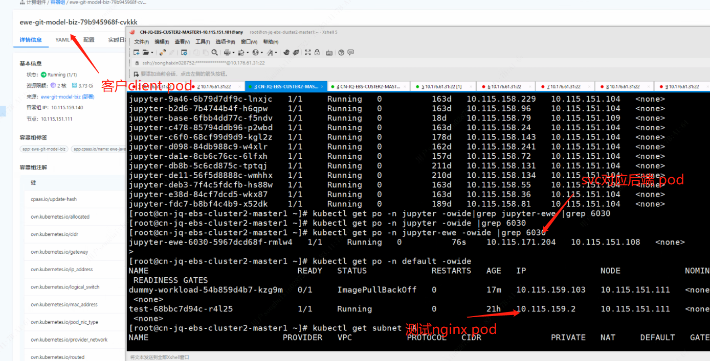
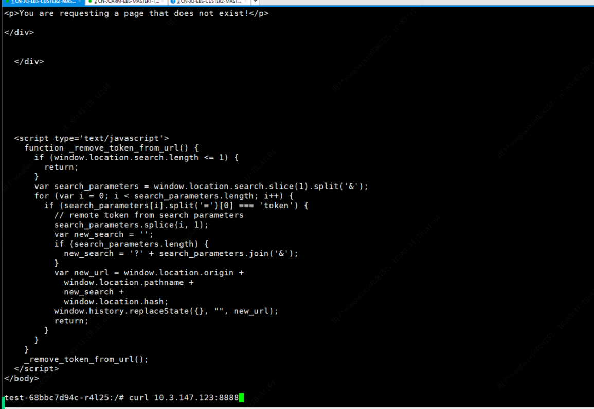
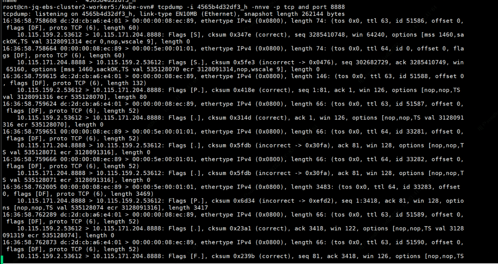
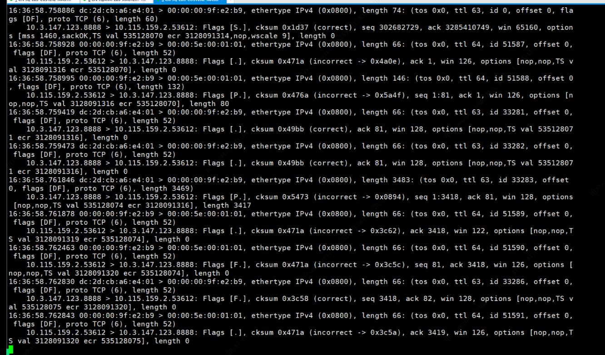
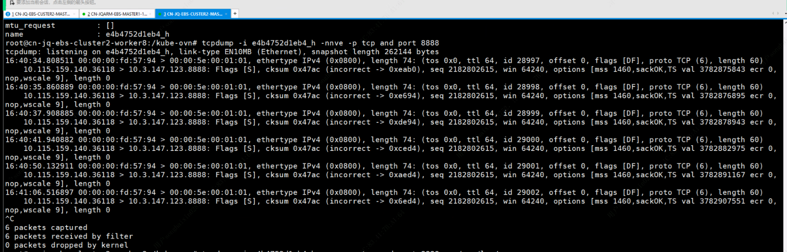

---kind:   - Troubleshootingproducts:    - Alauda Container Platform   - Alauda DevOps   - Alauda AI   - Alauda Application Services   - Alauda Service Mesh   - Alauda Developer PortalProductsVersion:   - 4.1.0,4.2.x---<!-- A type of document that involves encountering a fault, diag...it, performing root cause analysis, and providing solutions. --># 国泰君安，集群内两个节点上的某一个应用无法访问内部的svcpod部署在111节点时跨节点访问svc不通 仅客户client pod访问客户server pod时异常 client pod网卡抓包显示报文未到达server节点underlay网卡## Cause- 网络设备报文转发异常- underlay网络网关可能存在ACL限制或路由问题## Resolution- 联系iaas团队排查underlay网络设备转发策略## [workaround]## [Related Information]**Screenshots**- Environment: Kubernetes kube-ovn underlay/ACP 3.14.2- kube-ovn- underlay网络- 10.115.159.0/24子网- ACP组件- Component: Kubernetes- Page ID: 231116371- Original Title: 国泰君安，集群内两个节点上的某一个应用无法访问内部的svc