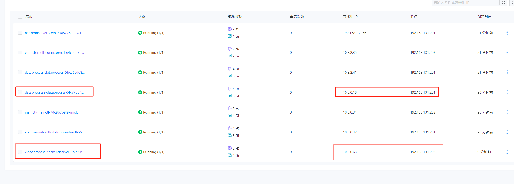

---
kind:
  - Troubleshooting
products:
  - Alauda Container Platform
  - Alauda DevOps
  - Alauda AI
  - Alauda Application Services
  - Alauda Service Mesh
  - Alauda Developer Portal
ProductsVersion:
  - 4.1.0,4.2.x
---
<!-- A type of document that involves encountering a fault, diagnosing it, performing root cause analysis, and providing solutions. -->

# overlay网络snat

UDP大包触发SNAT 分片报文未命中ovn lb规则 非首分片报文因缺少端口信息无法匹配规则

## Cause
- 内核ovs处理UDP分片时先分片后dnat
- 非首分片报文缺少源/目的端口信息

## Resolution
- 升级内核至5.15以上
- 使用headless类型svc
- 更换网络插件

## [workaround]
- ethtool -K eth0 ufo off

## [Related Information]
**Screenshots**

- Environment: 3.14.1
- ovn lb规则
- clusterIP
- UDP分片
- udp-fragmentation-offload
- Component: kube-Ovn
- Page ID: 231116379
- Original Title: 容器平台-overlay网络snat-84864
