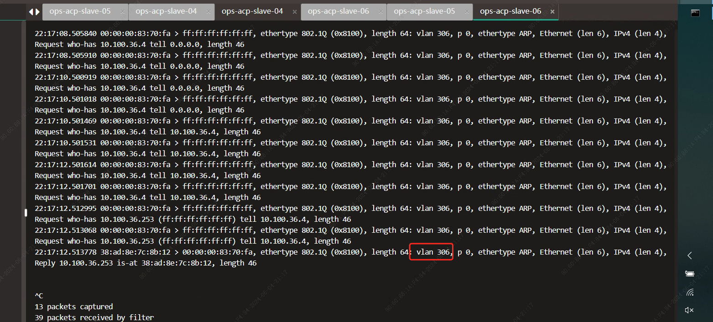
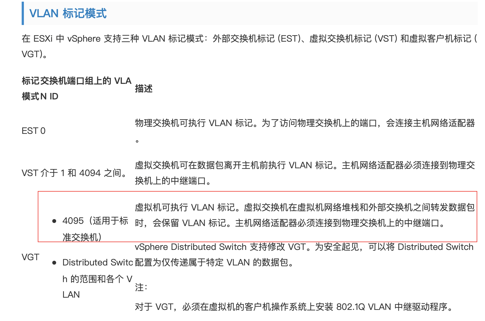

---
kind:
  - Troubleshooting
products:
  - Alauda Container Platform
  - Alauda DevOps
  - Alauda AI
  - Alauda Application Services
  - Alauda Service Mesh
  - Alauda Developer Portal
ProductsVersion:
  - 4.1.0,4.2.x
---
<!-- A type of document that involves encountering a fault, diagnosing it, performing root cause analysis, and providing solutions. -->

# v3.12

pod无法分配ip underlay网卡ip测试和网关不通 ovn发出的报文带有vlan tag

## Cause
- 虚拟交换机(vswitch)网口配置了vlan id导致报文被双重封装

## Resolution
- 调整虚拟二层交换机配置，去掉vlan id

## [workaround]

## [Related Information]
**Screenshots**

- Environment: 3.12.2
- vlan
- ovn
- vswitch
- ens224
- vlan id 74
- Component: kube-Ovn
- Page ID: 231116396
- Original Title: v3.12-容器平台-网络-underlay部署后pod无法分配ip
