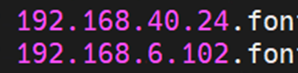
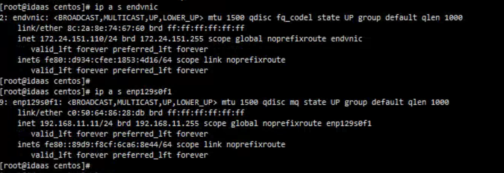
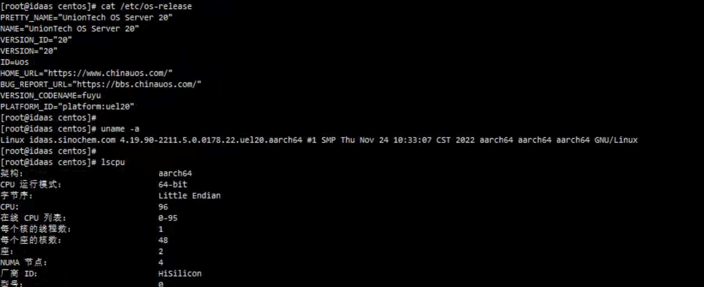
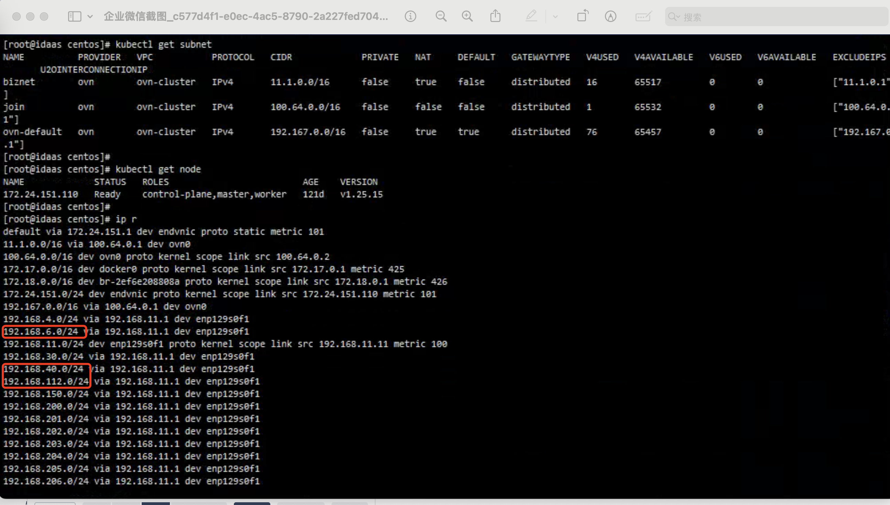
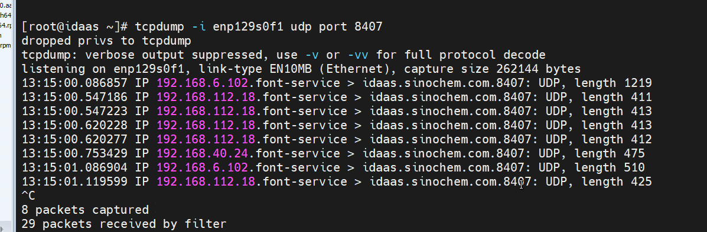
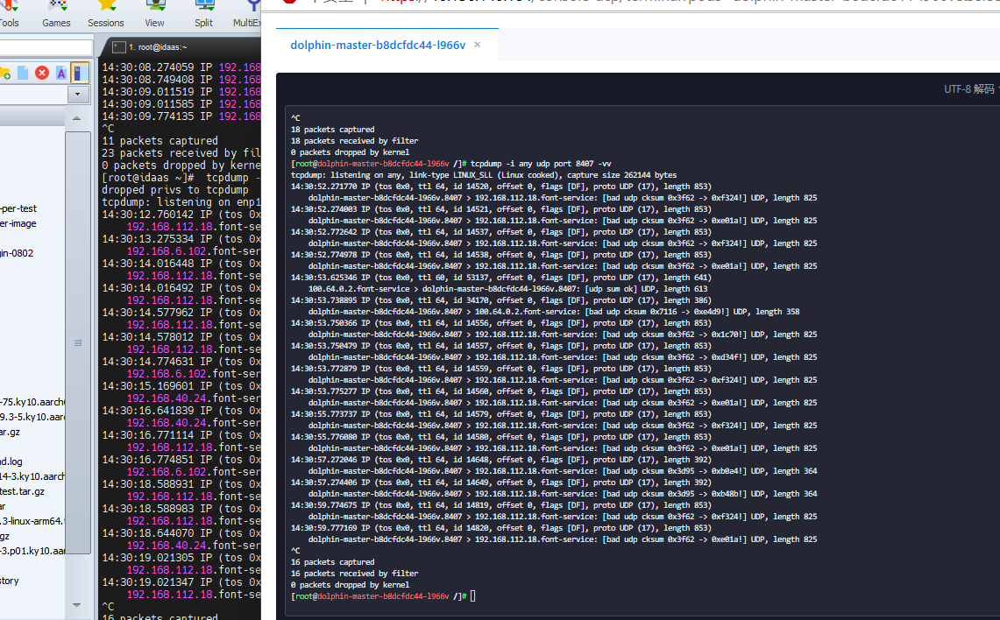
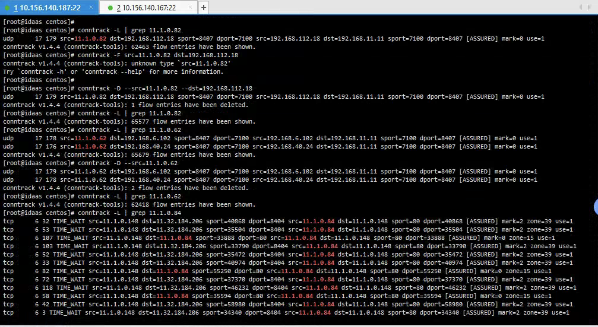

---kind:   - Troubleshootingproducts:    - Alauda Container Platform   - Alauda DevOps   - Alauda AI   - Alauda Application Services   - Alauda Service Mesh   - Alauda Developer PortalProductsVersion:   - 4.1.0,4.2.x---<!-- A type of document that involves encountering a fault, diag...it, performing root cause analysis, and providing solutions. --># 中化信息，UOS 系统，集群外访问 pod 失败集群外192.168.40/6网段无法访问NodePort服务 物理网卡/ovn0网卡抓到目标为11.1.0.62/82的报文 容器内部抓包无192.168.40/6网段流量## Cause- conntrack未及时更新残留旧Pod IP映射- UOS系统conntrack模块可能存在更新延迟bug## Resolution- 清理无效conntrack记录: conntrack -D## [workaround]## [Related Information]**Screenshots******- Environment: UOS, kube-ovn v1.11.12, ACP 3.14.1, 单节点集群- conntrack- kube-ovn- NodePort 8407/udp- IPVS- iptables- svc endpoints- Component: Kubernetes- Page ID: 234983002- Original Title: 中化信息，UOS 系统，集群外访问 pod 失败